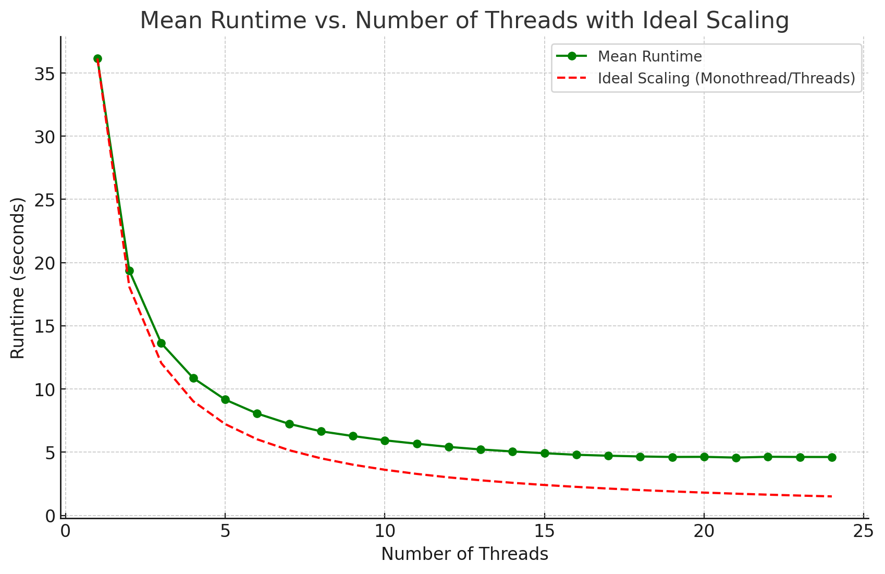

# Experiments on hyper-k-mers {#sec-kfc-supplementary}

## Datasets {#sec-kfc-datasets}

@tbl-datasets lists the datasets used in the experiments and their characteristics.

:::{#tbl-datasets .large-table}
| Name | Type | Coverage | \# reads | Total length | Min. | Avg. | Max. |
|:--|:--:|--:|--:|---:|-:|--:|--:|
| `SRR11434954` | HiFi | 5000× | 1,789,131 | 23,122,913,014 | 46 | 12,924.1 | 26,294 |
| `SRR28370642` | ONT Duplex | 50× | 114,703 | 236,908,842 | 349 | 2,065.4 | 126,029 |
| `SRR28370651` | ONT Duplex | 50× | 109,061 | 226,502,819 | 330 | 2,076.8 | 125,012 |
| `SRR28370668` | ONT Simplex | 2000× | 6,819,683 | 9,101,103,830 | 1 | 1,334.5 | 396,011 |

E. Coli datasets used for benchmarking KFC. Min., Avg. and Max. refer to the minimum, average and maximum read length in bases.
:::

## Multi-threading efficiency {#sec-kfc-multithread}

KFC effectively utilizes multi-core architectures, achieving performance gains with up to several dozen cores before experiencing diminishing returns (@fig-plot-ont-100x-multithread).

:::{#fig-plot-ont-100x-multithread}
<!--  -->

{width=80%}

Multi-core usage efficiency of KFC on the 100× HiFi E. coli dataset.
:::

## Effect of coverage {#sec-kfc-coverage}

@fig-combined-benchmark-coverage shows benchmarks similar to @fig-combined-benchmark-all but at various coverage levels, without significant change in the relative behaviors of the tools.

:::{#fig-combined-benchmark-coverage layout-ncol=2}
<!--  -->


/kmer counting benchmark on the ONT Simplex E. coli dataset (SRR28370668) at 50×, 200× and 500× coverage.
Each subfigure shows memory usage (left) and runtime (right) as a function of /kmer size $k$.
:::

@fig-plot-gut-full shows the benchmark on the complete (unsampled) HiFi human gut dataset.

:::{#fig-plot-gut-full layout-ncol=2}
<!--  -->


/kmer counting benchmark on the complete HiFi human gut datasets (SRR15275210, SRR15275211, SRR15275212, SRR15275213), filtering /kmers appearing once or twice (abundance threshold $t = 3$).
:::

## Effect of not filtering unique /kmers {#sec-kfc-nofilter}

@fig-combined-benchmark-nofilter shows the same benchmarks as @fig-combined-benchmark-all but without filtering unique /kmers (abundance threshold $t = 1$).
Jellyfish's performance is unchanged; FastK and KMC's performance degrades significantly in both time and memory.
KFC remains competitive even without filtering, compared to its competitors that do filter.

:::{#fig-combined-benchmark-nofilter layout-ncol=2}
<!--  -->


Comparison of /kmer counting benchmarks on ONT Duplex, PacBio HiFi and ONT Simplex E. coli datasets, without filtering unique /kmers.
:::

## KFC's algorithm {#sec-kfc-algorithm}

@alg-kfc gives an overview of the two passes of KFC.

::: {#alg-kfc}

```pseudocode
#| html-no-end: true
#| html-indent-lines: true
#| html-line-number: false
#| html-comment-delimiter: "//"
#| pdf-line-number: false
#| pdf-no-end: true
#| pdf-indent-lines: true
#| pdf-italic-comment: true
#| pdf-right-comment: true
#| pdf-comment-color: "darkgray"
#| pdf-comment-delimiter: "//"

\begin{algorithmic}
\Function{CountHyperkmer}{\texttt{read\_set} $\in (\Sigma^+)^+$; $k, m, t \in \mathbb{N}$ with $m \leq k$}
    \State \texttt{sk\_count} $\gets$ empty multimap
    \Comment{maps minimizer to (hash(\texttt{sk}), count(\texttt{sk}))}
    \State \texttt{hk\_count} $\gets$ empty multimap
    \Comment{maps minimizer to (\texttt{id\_left}, \texttt{id\_right}, count(\texttt{hk}))}
    \State \texttt{hk\_parts} $\gets$ empty vector of bitpacked strings
    \Comment{2 bits per character}
    \For{\texttt{read} in \texttt{read\_set}}
    \Comment{First pass, can be parallelized}
        \For{(\texttt{prev\_sk}, \texttt{sk}, \texttt{next\_sk}) in \texttt{read}}
            \State \texttt{mini} $\gets$ minimizer of \texttt{sk}
            \If{(hash(\texttt{sk}), $c$) $\in \texttt{sk\_count}[\texttt{mini}]$}
                \State $c \gets c + 1$
                \State increment the corresponding entry in \texttt{sk\_count}[\texttt{mini}]
            \Else
                \State $c \gets 1$
                \State add (hash(\texttt{sk}), 1) to \texttt{sk\_count}[\texttt{mini}]
            \EndIf
            \If{$c = t$}
            \Comment{\texttt{sk} just became solid: insert its hyper-k-mer}
                \If{\Call{IsSolid}{\texttt{sk\_count}, \texttt{prev\_sk}, $t$}}
                \Comment{if previous is solid, reuse its right part}
                    \State \texttt{id\_left} $\gets$ id of right part of \texttt{prev\_sk} in \texttt{hk\_count}
                \Else
                    \State \texttt{id\_left} $\gets |\texttt{hk\_parts}|$
                    \State append left part of \texttt{sk} to \texttt{hk\_parts}
                \EndIf
                \If{\Call{IsSolid}{\texttt{sk\_count}, \texttt{next\_sk}, $t$}}
                \Comment{if next is solid, reuse its left part}
                    \State \texttt{id\_right} $\gets$ id of left part of \texttt{next\_sk} in \texttt{hk\_count}
                \Else
                    \State \texttt{id\_right} $\gets |\texttt{hk\_parts}|$
                    \State append right part of \texttt{sk} to \texttt{hk\_parts}
                \EndIf
                \State add (\texttt{id\_left}, \texttt{id\_right}, $c$) to \texttt{hk\_count}[\texttt{mini}]
            \ElsIf{$c > t$}
            \Comment{\texttt{sk} already indexed: update count}
                \State (\texttt{id\_left}, \texttt{id\_right}, exact) $\gets$ \Call{LookupAndUpdate}{\texttt{hk\_count}, \texttt{hk\_parts}, \texttt{sk}}
                \If{not exact}
                    \State add (\texttt{id\_left}, \texttt{id\_right}, 1) to \texttt{hk\_count}[\texttt{mini}]
                \EndIf
            \EndIf
        \EndFor
    \EndFor
    \For{\texttt{read} in \texttt{read\_set}}
    \Comment{Second pass, can be parallelized}
        \For{\texttt{sk} in \texttt{read}}
        \Comment{handle non-solid super-k-mers sharing a minimizer with a solid one}
            \State \texttt{mini} $\gets$ minimizer of \texttt{sk}
            \If{first or last super-$k$-mer}
                \State (\texttt{id\_left}, \texttt{id\_right}, exact) $\gets$ \Call{LookupAndUpdate}{\texttt{hk\_count}, \texttt{hk\_parts}, \texttt{sk}}
                \If{not exact}
                    \If{$\texttt{id\_left} = -1$}
                        \State \texttt{id\_left} $\gets |\texttt{hk\_parts}|$
                        \State append left part of \texttt{sk} to \texttt{hk\_parts}
                    \EndIf
                    \If{$\texttt{id\_right} = -1$}
                        \State \texttt{id\_right} $\gets |\texttt{hk\_parts}|$
                        \State append right part of \texttt{sk} to \texttt{hk\_parts}
                    \EndIf
                    \State add (\texttt{id\_left}, \texttt{id\_right}, 1) to \texttt{hk\_count}[\texttt{mini}]
                \EndIf
            \ElsIf{not \Call{IsSolid}{\texttt{sk\_count}, \texttt{sk}, $t$}}
                \State \Call{LookupAndUpdate}{\texttt{hk\_count}, \texttt{hk\_parts}, \texttt{sk}}
            \EndIf
        \EndFor
    \EndFor
    \State \Return \texttt{sk\_count}, \texttt{hk\_count}, \texttt{hk\_parts}
\EndFunction
\State{$\quad$}

\Function{IsSolid}{\texttt{sk\_count}, \texttt{sk}, $t$}
\Comment{checks if a super-k-mer has reached threshold $t$}
    \State \texttt{mini} $\gets$ minimizer of \texttt{sk}
    \For{$(h, c) \in \texttt{sk\_count}[\texttt{mini}]$}
        \If{$h = \text{hash}(\texttt{sk})$}
            \State \Return $c \geq t$
        \EndIf
    \EndFor
    \State \Return \texttt{false}
\EndFunction
\State{$\quad$}

\Function{LookupAndUpdate}{\texttt{hk\_count}, \texttt{hk\_parts}, \texttt{sk}}
\State{\textit{// search if a super-k-mer is indexed in the hyper-k-mer index}}
\State{\textit{// return the position of the left and right hyper-k-mer parts that include it}}
\State{\textit{// and a boolean indicating if the super-k-mer is indexed}}
\State{\textit{// if the super-k-mer is indexed, the count of its entry is increased}}
    \State \texttt{mini} $\gets$ minimizer of \texttt{sk}
    \State \texttt{id\_left}, \texttt{id\_right} $\gets -1, -1$
    \Comment{-1: sentinel for ``not found''}
    \For{$(l, r, c) \in \texttt{hk\_count}[\texttt{mini}]$}
        \If{$(\texttt{hk\_parts}[l], \texttt{hk\_parts}[r]) = \texttt{sk}$}
            \State $c \gets c + 1$
            \State \Return $(l, r, \texttt{true})$
        \EndIf
        \If{\texttt{sk} starts with \texttt{hk\_parts}[$l$]}
            \State \texttt{id\_left} $ \gets l$ \EndIf
        \If{\texttt{sk} ends with \texttt{hk\_parts}[$r$]}
            \State \texttt{id\_right} $ \gets r$ \EndIf
    \EndFor
    \State \Return (\texttt{id\_left}, \texttt{id\_right}, \texttt{false})
\EndFunction
\end{algorithmic}
```

KFC's two-pass /kmer counting algorithm using /hkmers.
:::
