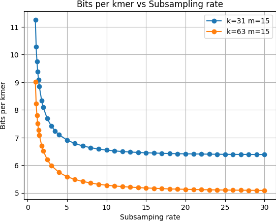

# Proofs and experiments on fractional hitting sets

## Useful lemmas {#sec-useful-lemmas}

:::{#lem-o1}
Assuming $p$ is non-increasing with respect to $w$,
$1 - (1 - p)^{w+1} \underset{w \to \infty}{=} f + o(1)$
:::

:::{.proof}
$(1-p)^{w+1} = (1-p)^w - p (1-p)^w$

- if $p \underset{w \to \infty}{\longrightarrow} 0$, $p (1-p)^w \underset{w \to \infty}{\longrightarrow} 0$
- otherwise $p \ge c$ for some $c > 0$ since it is non-increasing, so $p (1 - p)^w \le p (1 - c)^w \underset{w \to \infty}{\longrightarrow} 0$

Therefore,
$(1-p)^{w+1} = (1-p)^w + o(1)$
:::

We use $\widehat{\mathcal{S}}$ to denote the set of /kmers containing a small $m$-mer.

:::{#lem-twin}
Given two consecutive /kmers $W_0$ and $W_1$,
$\Pr(W_0, W_1 \in \widehat{\mathcal{S}}) \underset{w \to \infty}{=} f + o(1)$
:::

:::{.proof}
$$\begin{aligned}
\Pr(W_0, W_1 \in \widehat{\mathcal{S}}) & = 1 - \Pr(W_0 \notin \widehat{\mathcal{S}} \lor W_1 \notin \widehat{\mathcal{S}}) \\
& = 1 - \left[\Pr(W_0 \notin \widehat{\mathcal{S}}) + \Pr(W_1 \notin \widehat{\mathcal{S}}) - \Pr(W_0 \notin \widehat{\mathcal{S}} \land W_1 \notin \widehat{\mathcal{S}})\right] \\
& = 1 - 2 (1 - p)^w + (1 - p)^{w+1} = 1 - (1 - p)^w + o(1) \\
% \quad (\text{Lemma } \ref{lem-o1}) \\
& = f + o(1)
\end{aligned}$$
:::

:::{#lem-eqp}
$p \underset{w \to \infty}{=} -\frac{1}{w} \ln(1 - f) + o(1/w)$
:::

:::{.proof}
Because of @prp-burger-king, we have
$p = 1 - (1 - f)^{1/w}$
and
$$(1 - f)^{1/w} = \exp\left[\frac{1}{w} \ln(1 - f)\right] = 1 + \frac{1}{w} \ln(1 - f) + o(1/w)$$
:::

## Proof of @thm-density

In order to upper bound the density, we follow the same approach as the one presented in [@miniception] (for the proof of theorem 7).
As stated in [@miniception], the density is equivalent to the probability that a context $c$ (that is, the string formed by two consecutive /kmers) is *charged*, i.e. the two /kmers of $c$ have different minimizers.
$$\begin{aligned}
d & = \Pr_{c, h}(c \text{ is charged}) \\
& \le \Pr_{c, h}(c \text{ has duplicate } m\text{-mers}) + \Pr_{c, h}\left(c \text{ is charged}\ |\ \text{no duplicate } m\text{-mers}\right)
\end{aligned}$$

:::{#lem-dup-mers}

## lemma 9 from [@miniception]

Assuming $m > (3 + \varepsilon) \log_\sigma w$,
$$\Pr_{c, h}(c \text{ has duplicate } m\text{-mers}) = o(1 / w)$$
:::

If $c$ has no duplicate $m$-mers, the small $m$-mers are all distinct and each of them has the same probability to be minimal since $h$ is random.
Therefore,
$$\Pr_{c, h}\left(c \text{ is charged}\ |\ \text{no duplicate } m\text{-mers}\right) = \mathbb{E}_{c, h}\left[\frac{M_{boundary}}{M_{total}}\right]$$
where $M_{boundary}$ denotes the number of boundary $m$-mers that are small and $M_{total}$ denotes the total number of small $m$-mers in $c$.

Let $x_0$ denote the first $m$-mer of $c$ and $x_w$ denote the last one,
$$\begin{aligned}
\mathbb{E}_{c, h}\left[\frac{M_{boundary}}{M_{total}}\right] & = \mathbb{E}_{c, h}\left[\frac{\mathbf{1}_{x_0 \in \mathcal{S}} + \mathbf{1}_{x_w \in \mathcal{S}}}{M_{total}}\right] = 2 \cdot \mathbb{E}_{c, h}\left[\frac{\mathbf{1}_{x_0 \in \mathcal{S}}}{M_{total}}\right] \quad (\text{symmetry}) \\
& = 2 \cdot \mathbb{E}_{c, h}\left[1 / M_{total}\ |\ x_0 \in \mathcal{S}\right] \cdot \Pr(x_0 \in \mathcal{S})
\end{aligned}$$

Assuming $x_0$ is small, we have $M_{total} = 1 + X$ with $X \sim B(w, p)$, since each other $m$-mer of $c$ has a probability $p$ to be small.
$$\mathbb{E}_{c, h}\left[1 / M_{total}\ |\ x_0 \in \mathcal{S}\right] = \mathbb{E}_{c, h}\left[\frac{1}{1 + X}\right] = \sum_{i = 0}^w \frac{1}{1 + i} \binom{w}{i} p^i (1-p)^{w-i}$$

:::{#lem-wolfram}
$\sum_{i = 0}^w \frac{1}{1 + i} \binom{w}{i} p^i (1-p)^{w-i} = \frac{1 - (1 - p)^{w+1}}{(w + 1) p}$
:::

:::{.proof}
$$\begin{aligned}
& (w+1) p \sum_{i = 0}^w \frac{1}{1 + i} \binom{w}{i} p^i (1-p)^{w-i} = \sum_{i = 0}^w \frac{w+1}{1 + i} \frac{w!}{i! (w-i)!} p^{i+1} (1-p)^{w-i} \\
& = \sum_{i = 0}^w \frac{(w+1)!}{(i+1)! (w+1-(i+1))!} p^{i+1} (1-p)^{w+1-(i+1)} = \sum_{j = 1}^{w+1} \binom{w+1}{j} p^{j} (1-p)^{w+1-j} \\
& = 1 - (1-p)^{w+1}
\end{aligned}$$
:::

Finally, since $\Pr(x_0 \in \mathcal{S}) = p$,
$$d \le 2 \cdot \frac{1 - (1 - p)^{w+1}}{w + 1} + o(1/w) = \frac{2 f}{w + 1} + o(1/w)
% \quad (\text{Lemma } \ref{lem-o1})
$$

## Proof of @thm-density-sub

In this section, **we assume that every /kmer we work with contains a small $m$-mer**.

Just as for the proof of @thm-density, we still have

$d \le \Pr_{c, h}(c \text{ has duplicate } m\text{-mers}) + \Pr_{c, h}\left(c \text{ is charged}\ |\ \text{no duplicate } m\text{-mers}\right)$

and
$$\begin{aligned}
\Pr_{c, h}\left(c \text{ is charged}\ |\ \text{no duplicate } m\text{-mers}\right) & = \mathbb{E}_{c, h}\left[\frac{M_{boundary}}{M_{total}}\right] \\ &= 2 \cdot \mathbb{E}_{c, h}\left[1 / M_{total}\ |\ x_0 \in \mathcal{S}\right] \cdot \Pr(x_0 \in \mathcal{S}\ |\ W_1 \in \widehat{\mathcal{S}})
\end{aligned}$$

:::{#lem-dup-mers-sub}
Assuming $m > (3 + \varepsilon) \log_\sigma w$,
$\Pr_{c, h}(c \text{ has duplicate } m\text{-mers}) = o(1 / w)$
:::

:::{.proof}
This proof is similar to the proof of lemma 9 from [@miniception].
Let $i, j \in \llbracket 0, w \rrbracket$ with $i < j$, $\delta = j - i$.

If $\delta < m$,
$\Pr(x_i = x_j) = \frac{\sigma^\delta}{\sigma^{m + \delta}} = \frac{1}{\sigma^m} = o(1/w^3)$

If $\delta \ge m$,
$$\begin{aligned}
\Pr(x_i = x_j) & = \Pr(x_i = x_j\ |\ x_i, x_j \in \mathcal{S}) \Pr(x_i, x_j \in \mathcal{S}) + \Pr(x_i = x_j\ |\ x_i, x_j \notin \mathcal{S}) \Pr(x_i, x_j \notin \mathcal{S}) \\
& = \frac{\Pr(x_i, x_j \in \mathcal{S})}{p \cdot \sigma^m} + \frac{\Pr(x_i, x_j \notin \mathcal{S})}{(1-p) \sigma^m}
\end{aligned}$$
Because of @lem-twin,
$\Pr(x_i, x_j \in \mathcal{S}) = \frac{p^2}{\Pr(W_0, W_1 \in \widehat{\mathcal{S}})} = \frac{p^2}{f + o(1)} \le p$
and
$$\Pr(x_i, x_j \notin \mathcal{S}) \le \frac{(1-p)^2 \left[1 - (1-p)^{w-1}\right]}{\Pr(W_0, W_1 \in \widehat{\mathcal{S}})} = \frac{(1-p)^2 \left[1 - (1-p)^{w-1}\right]}{f + o(1)} \le (1-p)^2$$
Therefore,
$\Pr(x_i = x_j) \le \frac{p}{p \cdot \sigma^m} + \frac{(1-p)^2}{(1-p) \sigma^m} \le \frac{2}{\sigma^m} = o(1/w^3)$

Thus
$\Pr_{c, h}(c \text{ has duplicate } m\text{-mers}) = \binom{w}{2} \times o(1/w^3) = o(1/w)$
:::

Assuming $x_0$ is small, the $w$ next $m$-mers of $c$ form a /kmer, so we know that at least one of them is also small.
Therefore,
$$\begin{aligned}
& \mathbb{E}_{c, h}\left[1 / M_{total}\ |\ x_0 \in \mathcal{S}\right] = \mathbb{E}_{c, h}\left[\frac{1}{1 + X}\ |\ X \ge 1\right] = \frac{1}{\Pr(X \ge 1)} \sum_{i = 1}^w \frac{1}{1 + i} \binom{w}{i} p^i (1-p)^{w-i} \\
& = \frac{1}{f} \left[\frac{1 - (1 - p)^{w+1}}{(w + 1) p} - (1 - p)^w\right] = \frac{1}{f} \left[\frac{f + o(1)}{(w + 1) p} - (1 - f)\right]
% \quad (\text{Lemma } \ref{lem-wolfram} \text{ and } \ref{lem-o1})
\end{aligned}$$

What's more,
$\Pr(x_0 \in \mathcal{S}\ |\ W_1 \in \widehat{\mathcal{S}}) = \frac{\Pr(x_0 \in \mathcal{S})}{\Pr(W_1 \in \widehat{\mathcal{S}})} = \frac{p}{f}$.

Hence,
$$\begin{aligned}
d & \le \frac{2 p}{f^2} \left[\frac{f + o(1)}{(w + 1) p} - (1 - f)\right] + o(1/w) = \frac{2}{f (w+1)} - \frac{2 (1 - f) p}{f^2} + o(1/w) \\
& = \frac{2}{f (w+1)} + \frac{2 (1 - f) \ln (1 - f)}{f^2 w} + o(1/w) \\
% \quad (\text{Lemma } \ref{lem-eqp}) \\
& = 2 \cdot \frac{f + (1 - f) \ln (1 - f)}{f^2 (w+1)} + o(1/w)
\end{aligned}$$

## Proof of @thm-max-skmers

In order to compute the proportion of maximal /skmers, we adapt the proof of theorem 4 from [@lphash].

:::{#fig-minimizer-markov-chain}

```{.tikz}
%%| filename: minimizer-markov-chain
%%| opt-additional-packages: \usepackage{amssymb}
%%| opt-zoom: 1.5

\usetikzlibrary{positioning}
\usetikzlibrary{arrows.meta}
\usetikzlibrary{shapes}

\tikzset{
    >=latex,
    every edge/.style={draw, ultra thick},
    every node/.style={thick, font=\small},
    node/.style={circle, draw, fill=white},
}
\definecolor{good}{HTML}{4db6ac}
\definecolor{bad}{HTML}{f06292}
\definecolor{gamble}{HTML}{ffd54f}
\definecolor{seeya}{HTML}{90a4ae}

\begin{tikzpicture}[node distance=1cm and 1cm]
    \node (1) [node] {$1$};
    \node (2) [node, right=of 1] {$2$};
    \node (skip) [right=of 2] {$\dots$};
    \node (w-1) [node, ellipse, right=of skip] {$w-1$};
    \node (w) [node, right=of w-1] {$w$};
    \node (none) [node, below=of skip] {$\varnothing$};
    \draw[->, good] (w) edge (w-1) (w-1) edge (skip) (skip) edge (2) (2) edge (1);
    \draw[<-, bad, bend right, looseness=.7] (w) edge (w-1) edge (2);
    \draw[->, bad, loop right] (w) edge (w);
    \draw[->, gamble, bend right, looseness=.7] (1) edge (2) edge (w-1) edge (w);
    \draw[->, gamble, loop left] (1) edge (1);
    \draw[->, seeya, bend right, looseness=.7] (1) edge node[below, sloped] {$1 - f$} (none) (none) edge node[below, sloped] {$p$} (w);
    \draw[->, seeya, loop below] (none) edge node[below, sloped] {$1 - p$} (none);
    \matrix [above left=2mm of 2, every node/.style={draw, minimum width=5mm},] {
        \node[fill=bad, label=left:$\delta$] {};      \\
        \node[fill=good, label=left:$1 - \delta$] {}; \\
        \node[fill=gamble, label=left:$f / w$] {};    \\
    };
\end{tikzpicture}
```

The chain is in state $i \in \llbracket 1, w \rrbracket$ if the small minimizer starts at position $i$ in the /kmer, and $\varnothing$ if there is no small minimizer. Different edge colors represent different probabilities.
:::

First, we introduce a similar Markov chain representing the position $X$ of the small minimizer in the /kmer, with an extra state $\varnothing$ when there is no small minimizer.

We reuse the following notations introduced in [@lphash]:

- $P_{lr}$ is the proportion of left-right-max (i.e. maximal) /skmers
- $P_l$ is the proportion of left-max /skmers
- $P_r$ is the proportion of right-max /skmers
- $P_n$ is the proportion of non-max /skmers

$$\forall i \in \llbracket 1, w-1 \rrbracket, \Pr(\text{first } X = i) = \Pr(X = 1) \cdot \frac{f}{w}$$
$$P_{lr} + P_r = \Pr(X = w) = \Pr(\text{first } X = w) = 1 - \sum_{i=1}^{w-1} \Pr(\text{first } X = i) = 1 - \Pr(X = 1) \cdot f \cdot (1 - 1/w)$$
$$P_{lr} + P_l = \Pr(\text{last } X = 1) = \Pr(X = 1) + \Pr(\text{first } X = 1) = \Pr(X = 1) \cdot (1 + f/w)$$
By symmetry, $P_l = P_r$, so
$1 - \Pr(X = 1) \cdot f \cdot (1 - 1/w) = \Pr(X = 1) \cdot (1 + f/w)$

Therefore,
$\Pr(X = 1) = \frac{1}{1 + f}$ and $\Pr(X = w) = 1 - \frac{f}{1 + f} \left(1 - \frac{1}{w}\right) = \frac{1 + f/w}{1 + f}$

What's more,
$1 + P_{lr} = P_{lr} + P_l + P_{lr} + P_r + P_n = 2 \cdot \Pr(X = w) + P_n$

so
$$P_{lr} = P_n + 2 \cdot \Pr(X = w) - 1 = P_n + \frac{1 - f(1 - 2/w)}{1 + f} \text{ and } P_l = P_r = \Pr(X = w) - P_{lr} = \frac{f(1 - 1/w)}{1 + f} - P_n$$

$$\begin{aligned}
P_n & = \Pr(\text{first } X \neq w) \cdot \Pr(\text{last } X \neq 1) = \Pr(X = 1) \cdot f \cdot (1 - 1/w) \cdot \left[1 - \Pr(X = 1) \cdot (1 + f/w)\right] \\
& = \left(1 - \frac{1}{w}\right) \cdot \frac{f}{1 + f} \cdot \left[1 - \frac{1 + f/w}{1 + f}\right] = \left(1 - \frac{1}{w}\right) \cdot \frac{f}{1 + f} \cdot \frac{f (1 - 1/w)}{1 + f} = \left[\left(1 - \frac{1}{w}\right) \frac{f}{1 + f}\right]^2
\end{aligned}$$

Thus
$P_l = P_r = \left[\left(1 - \frac{1}{w}\right) \frac{f}{1 + f}\right] \left[1 - \left(1 - \frac{1}{w}\right) \frac{f}{1 + f}\right]$

and
$$P_{lr} = \left[\left(1 - \frac{1}{w}\right) \frac{f}{1 + f}\right]^2 + \frac{1 - f(1 - 2/w)}{1 + f}$$

## Proof of @thm-density-uhs

This proof generalizes the proof of @thm-density when the minimizers are selected from a UHS $\mathcal{U}$ with density $d_\mathcal{U}$.

First, because of independence, we have
$\Pr(x_0 \in \mathcal{S} \cap \mathcal{U}) = \Pr(x_0 \in \mathcal{S}) \cdot \Pr(x_0 \in \mathcal{U})$
and
$\Pr(|\mathcal{S} \cap \mathcal{U} \cap c| = i) = \sum_{n \ge i} \Pr(|\mathcal{U} \cap c| = n) \Pr(|\mathcal{S} \cap \mathcal{U} \cap c| = i\ |\ |\mathcal{U} \cap c| = n)$

The main change of the proof lies in the bound on the expectation:
$$\begin{aligned}
\mathbb{E} & \left[\frac{1}{|\mathcal{S} \cap \mathcal{U} \cap c|}\ |\ x_0 \in \mathcal{S} \cap \mathcal{U}\right] = \sum_{i=0}^w \frac{1}{i+1} \Pr\left(|\mathcal{S} \cap \mathcal{U} \cap c| = i+1\ |\ x_0 \in \mathcal{S} \cap \mathcal{U}\right) \\
& = \sum_{i=0}^w \frac{1}{i+1} \sum_{n=i}^w \Pr(|\mathcal{U} \cap c| = n+1\ |\ x_0 \in \mathcal{U}) \Pr(|\mathcal{S} \cap \mathcal{U} \cap c| = i+1\ |\ |\mathcal{U} \cap c| = n+1, x_0 \in \mathcal{S} \cap \mathcal{U}) \\
& = \sum_{n=0}^w \Pr(|\mathcal{U} \cap c| = n+1\ |\ x_0 \in \mathcal{U}) \sum_{i=0}^n \frac{1}{i+1} \Pr(|\mathcal{S} \cap \mathcal{U} \cap c| = i+1\ |\ |\mathcal{U} \cap c| = n+1, x_0 \in \mathcal{S} \cap \mathcal{U}) \\
& = \sum_{n=0}^w \Pr(|\mathcal{U} \cap c| = n+1\ |\ x_0 \in \mathcal{U}) \sum_{i=0}^n \frac{1}{i+1} \Pr(|\mathcal{S}| = i+1\ |\ x_0 \in \mathcal{S}, |W| = n) \\
& = \sum_{n=0}^w \Pr(|\mathcal{U} \cap c| = n+1\ |\ x_0 \in \mathcal{U}) \cdot \frac{1 - (1-p)^{n+1}}{(n+1) p} \\
% \quad (\text{Lemma } \ref{lem-wolfram}) \\
& \le \sum_{n=0}^w \Pr(|\mathcal{U} \cap c| = n+1\ |\ x_0 \in \mathcal{U}) \cdot \frac{f + o(1)}{(n+1) p}
% \quad (\text{Lemma } \ref{lem-o1})
\end{aligned}$$

Therefore, using the same arguments as in the proof of @thm-density, we obtain
$$\begin{aligned}
d_{\mathcal{S} \cap \mathcal{U}} & \le 2 \cdot \Pr(x_0 \in \mathcal{S} \cap \mathcal{U}) \cdot \mathbb{E}\left[\frac{1}{|\mathcal{S} \cap \mathcal{U} \cap c|}\ |\ x_0 \in \mathcal{S} \cap \mathcal{U}\right] + o(1/w) \\
& \le 2 \cdot \Pr(x_0 \in \mathcal{U}) \cdot \Pr(x_0 \in \mathcal{S}) \sum_{n=0}^w \Pr(|\mathcal{U} \cap c| = n+1\ |\ x_0 \in \mathcal{U}) \cdot \frac{f}{(n+1) p} + o(1/w) \\
& = f \cdot 2 \cdot \Pr(x_0 \in \mathcal{U}) \sum_{n=0}^w \frac{1}{n+1} \Pr(|\mathcal{U} \cap c| = n+1\ |\ x_0 \in \mathcal{U}) + o(1/w) \\
& = f \cdot d_\mathcal{U} + o(1/w)
\end{aligned}$$

## Additional figures

::: {layout-ncol=2}


Theoretical bounds on the density factor and the proportion of maximal /skmers depending on the fraction $f$ of covered /kmers.
:::

{#fig-bitperkmervssubsampling}

::: {#fig-ressalmok31 layout-nrow=3}


Salmonellas 1K k=31
:::

::: {#fig-resRefseqk63 layout-nrow=3}


Refseq 1K k=63
:::

::: {#fig-ressalmok63 layout-nrow=3}


Salmonellas 1K k=63
:::

::: {#fig-resErrorContainment layout-nrow=3}


Error for containment similarity approximation for sourmash (red line) and supersampler on different values for minimizer sizes.
:::

::: {#fig-resErrorJaccard layout-nrow=4}


Error for Jaccard similarity approximation for sourmash (red line) and supersampler on different values for minimizer sizes.
:::
