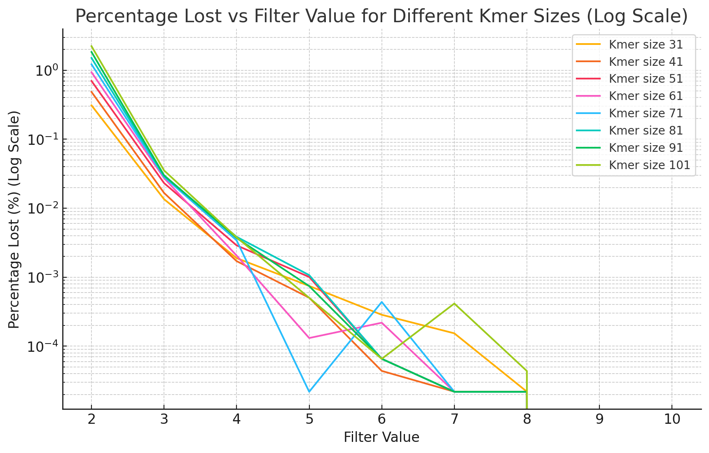
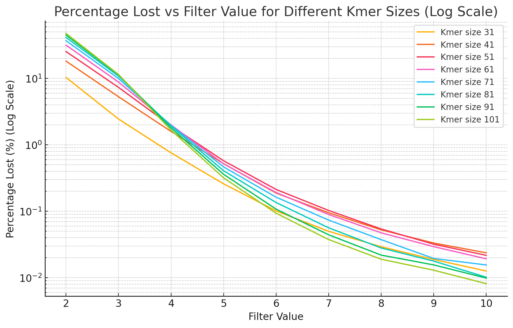

# From super‑k‑mers to hyper-k-mers

:::{.callout-note}
This chapter is adapted from .
:::

Representing DNA sequences as sets of /kmers, fixed-length sub-strings of length $k$, is a simple yet highly efficient approach in sequence bioinformatics by enabling accurate estimation of sequence similarity in linear time, circumventing the need for computationally intensive alignment steps.
Moreover, it naturally handles redundancy, as each unique /kmer is stored only once, regardless of its frequency in the DNA sequence.
This property is particularly beneficial when dealing with sequencing datasets that are inherently redundant due to high coverage depths (in the order of 1000x in large sequencing datasets).
Over the years, the use of /kmers has been extended to various applications such as genotyping [@nebula], phylogeny reconstruction [@ffp-comparison], and read error correction [@limasset_toward_2020].
However, naive storage of /kmers leads to significant space overheads, potentially up to a factor of $k$, since each position in the DNA sequence can generate a /kmer.
Additionally, sequencing errors introduce erroneous non-biologically-relevant /kmers.
As observed by Velvet [@velvet], for sufficiently large $k$'s, spurious /kmers only repeat a few times, since it is unlikely for two independent errors to produce the same /kmer.
However, due to high coverage depths, the total number of erroneous /kmers can easily outnumber the true genomic /kmers by orders of magnitude.
Filtering out infrequent /kmers, while retaining the highly frequent ones, has proven to be an extremely effective strategy for distinguishing true /kmers from errors.
This observation led to one of the simplest, yet most fundamental tasks in computational biology, known as */kmer counting*, which aims to associate /kmers to their occurrence counts in a dataset for filtering purposes.
Despite its apparent simplicity, /kmer counting is quite resource-intensive, as storing large numbers of /kmers along with their counts is expensive in terms of both memory and time.
Given their critical role in various applications, /kmer counting tools have historically focused on speed while limiting memory usage to practical levels.
A significant milestone was achieved with Jellyfish [@jellyfish], which implements a mutex-free hash table for high-throughput parallelism, achieving counting speeds akin to simple file reading.
Alternative approaches have utilized more efficient data structures for counting, such as counting quotient filters [@squeakr; @cqf], Burst tries [@kcmbt], and cuckoo hashing [@hackgap].
However, these methods still face the challenge of storing entire /kmers in main memory.
Some tools trade results accuracy for reduced memory usage by using probabilistic data structures like Bloom filters [@bfcounter; @roy2014turtle] or quotient filters [@squeakr] to remove low abundance /kmers before counting.
Another approach to reduce memory is to partition /kmers into buckets.
Buckets can be safely stored on disk and independently processed thus limiting the number of /kmers in main memory [@kmc2; @dsk].
Finally, some methods have attempted to accelerate /kmer counting by leveraging GPUs [@suzuki2014accelerating; @gerbil].

A significant advancement in reducing the memory footprint of /kmer storage was the introduction of /skmers [@mspkmercounter; @kmc2].
/Skmers encode $N$ successive /kmers sharing the same minimizer---the smallest sub-string of length $m$ within a /kmer, for a given ordering [@schleimer2003winnowing; @roberts2004reducing; @unitigs]---into $k + N - 1$ nucleotides.
Minimizers exhibit locality-sensitive hashing properties, functioning as a special case of MinHash with a single fingerprint, and have been widely used in /kmer partitioning [@bcalm2; @marchet2023scalable].
With the behavior of minimizers now well understood [@fhs], we can accurately estimate the representation cost of /skmers, leading to significant improvements in efficiency.
The adoption of /skmers has mitigated the memory issues of /kmer counting, and /skmer-based tools such as KMC3 [@kmc3] and FASTK [@fastk] are among the best tools of this competitive field.

Even in the absence of errors, efficient /kmer representations are still required to minimize memory footprint.
However, /skmers are still far from the optimal space efficiency, due to overlaps at their extremities, leading to unwanted redundancies.
Over the years, multiple efficient encodings of /kmer sets have been proposed [@unitigs; @eulertigs; @matchtigs], and allowed lightweight /kmer based tools [@ggcat; @sshash; @fulgor].
The common underlying principle is that redundancy can be decreased by merging overlapping /kmers.
One of the most well-known instances of this idea is the concept of *unitigs*, which are sequences formed by non-branching paths in de Bruijn graphs [@unitigs].
Unitigs are one of the most well-known de Bruijn graph representations, with duplications only occurring near branching paths.
Subsequent representation proposed to allow more merging even if they may be unsure biologically to be more succinct.
Such representations are essentially static, as they are constructed once from a complete set of /kmers.
In contrast, /skmers can be constructed on-the-fly during sequence parsing, making them a more versatile representation.
Moreover, this representation is inherently partitioned, since each /skmer (and thus each /kmer) is associated with its minimizer, which naturally facilitates indexing [@reindeer; @blight; @lphash].
A fundamental question is whether we can improve this convenient light-weight and partitioned representation to be as memory-efficient as static ones, thereby obtaining the best of both worlds.
Static representations achieve space close to the lower bound of 2 bits per nucleotide (over the four letters DNA alphabet), whereas /skmer representations are several times larger for commonly-used /kmer sizes ($k \approx 31$).
However, for $k \to +\infty$, /skmers tend to 6 bits per /kmer [@fhs].
Up until now, /kmer sizes have been quite small, due to the limited read lengths of next-generation sequencing (NGS) datasets.
However, larger /kmer sizes are becoming more practical thanks to continuous improvements in the accuracy of long-read sequencing technologies, such as Oxford Nanopore Technologies (ONT), whose reads are approaching 1% error rates [@sereika2021oxford], and PacBio HiFi sequencing with error rates as small as 0.1% [@bankevich2022multiplex].
These advancements enable the use of very large /kmer sizes in applications like genome assembly, /kmer analysis, and pangenomics.
Conversely, very large /kmer sizes degrade the performance of traditional efficient encoding methods (unitigs, simplitigs, eulertigs...), as overlap sizes increase linearly with $k$.
To address this challenge, we introduce the concept of */hkmers* as an alternative to /skmers, aiming to bridge the gap between dynamic and static representations.
Compared to /skmers, /hkmer-based representations are 33% lighter while displaying similar properties.
We demonstrate the practical interest of our approach by implementing and testing a new /kmer counting tool called KFC based on /hkmers.
KFC is both the fastest and the more memory-efficient tool for large $k$'s ($k \geq 200$), being the only one being more efficient as $k$ increases.
KFC supports `KFF`, a new standardized format for representing /kmer sets [@kff].

The rest of the paper is organized as follows.
In @sec-skmer-definitions, we formally define the concepts of /kmers, minimizers, /skmers, /hkmers, and the main goal of our work.
@sec-skmer-methods presents the theoretical analysis of /hkmers and details the algorithm and ideas behind our tool KFC.
@sec-kfc-evaluation reports experimental results to assess KFC's performance compared to other /kmer counting tools.
We conclude with discussions on possible future directions and general considerations.

## Definitions and problem statement {#sec-skmer-definitions}

In this section, we introduce the concepts at the basis of our exposition about /hkmers in @sec-skmer-methods.
For the most part, we re-use the notation from @mod-mini and @sshash, which we report here for convenience.
We considered strings defined over the alphabet $\Sigma = \{A, C, G, T\}$ of size $\sigma = 4$, and we use the terms *character*, *base* and *nucleotide* interchangeably.
Let $S \in \Sigma^*$ be a (genomic) string.
We refer to $S[i..j)$ as the substring of length $j - i$, starting at position $i$ (included) and ending at position $j$ (excluded).

:::{#def-kmer}
## /kmer

/kmers are substrings $S[i..i+k)$ of fixed length $k$.
:::

:::{#def-order}
## Order

An order $\mathcal{O}_m$ on $m$-mers is an injective function $\mathcal{O}_m : \Sigma^m \rightarrow \mathbb{R}$, such that $x \leq_{\mathcal{O}_m} y$ if and only if $\mathcal{O}_m(x) \leq \mathcal{O}_m(y)$.
:::

In practice, (pseudo-)random hash functions $h : \Sigma^m \rightarrow U$ are used to define an order [@lphash], where $U$ is a sufficiently large universe of possible values, like $U = 2^{64}$ if using 64-bit hash functions.

:::{#def-minimizer}
## (Random) minimizer

A minimizer of a /kmer $K$ is its minimal substring of length $m < k$ for a given (random) order $\mathcal{O}_m$.
:::

Minimizers have been widely studied in the literature [@schleimer2003winnowing; @roberts2004reducing; @mod-mini] and multiple selection methods, called *minimizer schemes*, have been proposed.
The efficiency of a minimizer scheme is usually measured by its *density*.

:::{#def-density}
## Density of a minimizer scheme

The density of a minimizer scheme is the expected proportion of selected minimizers over the number of $m$-mers in a random string.
:::

In particular, the density of random minimizers is equal to $d = 2 / (w + 1)$ [@schleimer2003winnowing], where $w = k - m + 1$ is the window size (the number of $m$-mers in a /kmer).
Thus, two neighboring /kmers overlapping by $k-1$ bases often share the same minimizer.

:::{#def-superkmer}
## /Skmer

A maximal sequence of consecutive /kmers having the same minimizer [@superkmers].
:::

:::{#def-overlap}
## Overlap of consecutive /skmers

Given two consecutive /skmers $u$ and $v$, we define the overlap of $u$ and $v$, denoted $\operatorname{ov}(u, v)$, as the $k - 1$ bases shared by the rightmost /kmer of $u$ and the leftmost /kmer of $v$.
:::

A straightforward method to reduce /kmer memory consumption is to store /skmers instead of /kmers.
Let $\mathscr{S}$ be the set of /kmers of string $S$.
Each character (base) in $S$ can be encoded using 2 bits since $\sigma = 4$.
Thus, naively storing set $\mathscr{S}$ requires $2k$ bits per nucleotide in $S$ (each character in $S$ is covered by $k$ /kmers, except the extremities), whereas a /skmer representation only requires 6 bits per nucleotide [@fhs].
While undoubtedly an improvement, /skmer space usage is still far away from the optimal achievable space of 2 bits per nucleotide of a completely (theoretical) linear representation of $\mathscr{S}$.
The remaining overhead comes from the $k-1$ bases overlaps between neighboring /skmers.

Our main goal is to find a representation of $\mathscr{S}$ whose space is < 6 bits per nucleotide.

## Methods {#sec-skmer-methods}

We start this section by introducing theoretical analysis of /skmers and their space requirements.
Next, we do the same for closed syncmers [@syncmers].
Syncmers have been shown to "pave" sequences better than other sampling techniques [@syncmers; @shibuya_efficient_2022], with a tendency to cover more bases than, e.g. minimizer-based sampling.
Despite not being suitable for representing /kmer sets, we think our theoretical results on closed syncmers are useful to put /hkmers into perspective.

### /Skmers {#sec-sk-space-analysis}

:::{#lem-sk-number}
## Average number of /skmers

Given a random string $S$, the expected number of /skmers is $(|S| - m + 1) \times d$.
:::

:::{.proof}
By definition of the density $d$, the expected number of minimizers is $(|S| - m + 1) \times d$.
Since each minimizer corresponds to one /skmer, the expected number of /skmers is the same.
:::

:::{#lem-sk-length}
## Average length of /skmers

Given a random string $S$, the average length of a /skmer is $\frac{|S| - k + 1}{(|S| - m + 1) \times d} + k - 1$.
In particular, it approaches $\frac{1}{d} + k - 1$ as $|S| \to +\infty$.
:::

:::{.proof}
By @lem-sk-number, there are $(|S| - m + 1) \times d$ /skmers on average.
Since there are $|S| - k + 1$ /kmers in $S$, each /skmer contains $\frac{|S| - k + 1}{(|S| - m + 1) \times d}$ /kmers on average, i.e. $\frac{|S| - k + 1}{(|S| - m + 1) \times d} + k - 1$ bases.
:::

:::{#thm-sk-space}
## /Skmer space usage

Given a random string $S$, the expected total number of bases in the /skmers of $S$ is asymptotically equivalent to $|S| \cdot (1 + (k - 1) \cdot d)$ as $|S| \to +\infty$.
:::

:::{.proof}
Let $S_{sk}$ denote the set of /skmers of $S$, $|S_{sk}|$ the number of /skmers in $S$ and $S_{sk}[i]$ denote the $i$-th /skmer of $S$.
The total number of characters in $S_{sk}$ is:
$$
\begin{aligned}
\sum_{i=0}^{i<|S_{sk}|} |S_{sk}[i]|
  &= |S_{sk}| \times \sum_{i=0}^{i<|S_{sk}|} \frac{|S_{sk}[i]|}{|S_{sk}|} \\
  &= (|S| - m + 1) \times d \times \sum_{i=0}^{i<|S_{sk}|} \frac{|S_{sk}[i]|}{|S_{sk}|}
    && \text{(See @lem-sk-number)} \\
  &= (|S| - m + 1) \times d \times \left( \frac{|S| - k + 1}{(|S| - m + 1) \times d} + k - 1 \right)
    && \text{(See @lem-sk-length)} \\
  &\underset{|S| \to +\infty}{\sim} |S| \times d \times \left( \frac{1}{d} + k - 1 \right) \\
  &= |S| \cdot (1 + (k - 1) \cdot d)
\end{aligned}
$$
:::

In particular, for random minimizers which have a density $d = 2 / (w + 1) = 2 / (k - m + 2)$, the average number of bases in a set of /skmers is asymptotically equivalent to $|S| \cdot \left( 1 + \frac{2 (k - 1)}{k - m + 2} \right) \sim 3 \cdot |S|$ when $k \gg m$.
Thus, a /skmer scheme requires $3$ bases per nucleotide in $|S|$, i.e. 6 bits per nucleotide in $|S|$ for an alphabet of size 4.

### Closed syncmers {#sec-syncmer-space-analysis}

:::{#def-closed-syncmer}
## Closed syncmer

A /kmer with a minimizer located at its start or its end.
:::

:::{#thm-syncmer-space}
## Closed syncmer space usage

Given a random string $S$, the expected total number of bases in the closed syncmers of $S$ is asymptotically equivalent to $|S| \cdot k \cdot d$ as $|S| \to +\infty$.
:::

:::{.proof}
Each /kmer consists of $w = k - m + 1$ $m$-mers.
Let us consider the last $w + 1$ $m$-mers after spawning a new minimizer.
Since a new minimizer has just been found, the smallest $m$-mer, among the last $w + 1$, is either the first (if the minimizer changed because the previous one went out of scope) or the last (if the new minimizer is smaller than the previous one).
If the smallest $m$-mer is the first one, then the previous /kmer is a closed syncmer.
Otherwise, the smallest $m$-mer is at the end of the last /kmer, which is thus a closed syncmer.
Thus, except the first minimizer, each minimizer creates a closed syncmer, so there are $(|S| - m + 1) \times d$ closed syncmers, on average, in $S$.
Since each closed syncmer has length $k$, the expected total number of bases is $(|S| - m + 1) \times d \times k$, which is asymptotically equivalent to $|S| \cdot k \cdot d$ as $|S| \to +\infty$.
:::

In particular, for random minimizers, the number of bases in a set of closed syncmers is asymptotically equivalent to $|S| \cdot \frac{2 \cdot k}{k - m + 2} \sim 2 \cdot |S|$, for $k \gg m$.
As such, closed syncmers require 2 bases per nucleotide in $|S|$, i.e. 4 bits for an alphabet of size 4.

### /Hkmers {#sec-hkmer-space-analysis}

:::{#fig-schema-hkmer}


Example of minimizers, /skmers and /hkmers for $m=3$ and $k=11$ using lexicographic order.
In this example, the original sequence contains 40 bases and /skmers use 70 bases while /hkmers use 50 bases.
:::

:::{#def-hyperkmer}
## /Hkmer

Given three consecutive /skmers $u$, $v$ and $w$, let $m_v$ be the minimizer of $v$.
We define the /hkmer associated to $m_v$ as $(\operatorname{ov}(u, v), \operatorname{ov}(v, w))$, and refer to $\operatorname{ov}(u, v)$ as its left part and $\operatorname{ov}(v, w)$ as its right part.
By convention, if $v$ has no predecessor in the sequence, we define its left part as the first $k-1$ bases and if it has no successor, we define its right part as the last $k - 1$ bases.
:::

We can already make a few observations based on this definition: every /hkmer contains exactly $2 (k - 1)$ bases and given two consecutive /hkmers $x$ and $y$, the right part of $x$ and the left part of $y$ are identical.
This means that we can effectively save $k-1$ bases for each pair of consecutive /hkmers.
@fig-schema-hkmer gives an example of /hkmers and shows that their overlapping parts can be shared.

:::{#thm-hkmer-space}
## /Hkmer space usage

Given a random string $S$, the expected total number of bases in the /hkmers of $S$ is asymptotically equivalent to $|S| \cdot (k - 1) \cdot d$ as $|S| \to +\infty$.
In addition, storing the links between the left and right parts results in a $2 \log_2(d|S|)$ bits overhead for each /hkmer.
:::

:::{.proof}
Each minimizer of $S$ is associated with one /hkmer, so there are $(|S| - m + 1) \times d$ /hkmers on average.
What's more, each pair of consecutive /hkmers shares $k-1$ bases which can be written only once.
Thus, except for the first /hkmer (which uses $2 (k-1)$ bases), each /hkmer uses $k-1$ bases.
Therefore, the expected total number of bases is $((|S| - m + 1) \times d + 1) \times (k - 1)$, which is asymptotically equivalent to $|S| \cdot (k - 1) \cdot d$ as $|S| \to +\infty$.
Finally, we need to maintain a "link" between the two parts of each /hkmer by storing their indices.
Since the expected number of /hkmers is equivalent to $d|S|$, each index takes $\log_2(d|S|)$ bits of space, leading to an overhead of $2 \log_2 (d|S|)$ bits for each /hkmer.
:::

In particular, for random minimizers, the number of bases in a set of /hkmers is asymptotically equivalent to $|S| \cdot \frac{2 \cdot (k - 1)}{k - m + 2} \sim 2$ bases per nucleotide in $|S|$, for $k \gg m$.
Moreover, assuming $m = \Omega(\log_2(d|S|))$, the space overhead of the links becomes negligible as $k \gg m$.
@fig-plot-space-hkmer-skmer gives an overview of the evolution of the space usage as $k$ increases, and compares it to the evolution of /skmers' space usage.

:::{#fig-plot-space-hkmer-skmer}


Space usage of /skmers and /hkmers for $k \in [30, 200]$, with random minimizers of size 21.
:::

These results, summarized in @tbl-space-usage, show that representing a set of /kmers using /hkmers is more space-efficient than /skmers and slightly more space-efficient than closed syncmers, regardless of the chosen minimizer scheme.
In particular, /hkmers require $\frac{2}{3}$ of the space used by /skmers for random minimizers, and this ratio gets even lower for minimizer schemes with a lower density.

:::{#tbl-space-usage .large-table}
| Representation | Expected number of bits / nucleotide | For random minimizers with $k \gg m = \Omega(\log_2(d|S|))$ |
|:---|:----:|:---:|
| /Skmers (@thm-sk-space) | $2 + 2 \cdot (k-1) \cdot d$ | 6 |
| Closed syncmers (@thm-syncmer-space) | $2 \cdot k \cdot d$ | 4 |
| /Hkmers (@thm-hkmer-space) | $2 \cdot (k-1) \cdot d + 2 \log_2(d|S|) \cdot d$ | 4 |

Comparison of the space usage of /skmers, closed syncmers and /hkmers.
:::

### Counting /kmers using /hkmers {#sec-kfc}

This section proposes /kmer counting as an application of /hkmers to a real-life use case.
/Hkmers are used as a proxy for storing /kmer counts.
A simplified overview of the resulting index is presented in @fig-schema-kfc.

:::{#fig-schema-kfc}


High-level view of the KFC data structure, using the example introduced in @fig-schema-hkmer.
Two data structures are maintained.
**Bottom**: a vector of /hkmer parts stores the left and right parts of the /hkmers computed from the original set of sequences.
The bold parts correspond to the (possibly truncated) minimizers of the sequence.
**Top**: a hash table associates each minimizer to a list of entries.
Each entry represents a /hkmer and its count.
Each /hkmer is represented using pointers (represented as dots) to its left and right parts in the vector of /hkmer parts.
To retrieve the parts, each pointer consists of the part's position in the vector, a start and end position in that part, and an orientation flag to handle reverse complements.
:::

Our /kmer counter implements a two-pass algorithm.
In the first stage, we iterate over /skmers in the input sequences.
We identify which /skmers are solid, i.e. are present more than twice in the input.
If a /skmer is solid, the /hkmer, along with its minimizer, is computed using its left and right /skmer neighbors (see @def-hyperkmer).
If a computed /hkmer was already present in the index, we increase its count in the hash table, otherwise, we insert a new entry in the table and insert the corresponding /hkmers in the vector (encoded using two bits per base).
However, doing so prevents us from counting the first and last /skmers of a read, as they are likely truncated and, by extension, unique and below our threshold.
It also prevents us from counting the non-solid /skmers sharing their minimizer with a solid /skmer (indicating a possible sequencing error in the non-solid /skmer, whose /kmers shared with the solid /skmers should *not* be discarded).

As such, the second stage consists of correcting these issues by re-reading the input.
Non-solid /skmers sharing their minimizer with solid /skmers which are substrings of /hkmers already in the index, are added to the internal hash table.
This also allows for the addition of the first and last /skmers of each read.
After these two stages, the only /kmers that will be wrongly discarded are the ones that **A/** are present more than two times in the input but **B/** belong to a non-solid /skmer that does not share its minimizer with any of the solid /skmers.
This /skmer-level threshold is slightly more aggressive than a /kmer-level threshold to filter unique /kmers.
The effects of this heuristic are discussed in @sec-kfc-internal.

As our algorithm works in a streaming fashion, at any time, only the index has to be maintained in memory whereas reads are only loaded on-demand.
This allows our implementation to have a light memory footprint (see @sec-kfc-evaluation), and to be parallelized (see @fig-plot-ont-100x-multithread in Supplementary Materials).

KFC's algorithm is given in @alg-kfc.
For clarity, we omit some details, such as how KFC handles subsequences in /hkmer parts.

:::{#alg-kfc}

```pseudocode
#| html-no-end: true
#| html-indent-lines: true
#| html-line-number: false
#| html-comment-delimiter: "//"
#| pdf-line-number: false
#| pdf-no-end: true
#| pdf-indent-lines: true
#| pdf-italic-comment: true
#| pdf-right-comment: true
#| pdf-comment-color: "darkgray"
#| pdf-comment-delimiter: "//"

\begin{algorithmic}
\Function{CountHyperkmer}{\texttt{read\_set} $\in (\Sigma^+)^+$; $k, m, t \in \mathbb{N}$ with $m \leq k$}
    \State \texttt{sk\_count} $\gets$ empty multimap
    \Comment{maps minimizer to (hash(\texttt{sk}), count(\texttt{sk}))}
    \State \texttt{hk\_count} $\gets$ empty multimap
    \Comment{maps minimizer to (\texttt{id\_left}, \texttt{id\_right}, count(\texttt{hk}))}
    \State \texttt{hk\_parts} $\gets$ empty vector of bitpacked strings
    \Comment{2 bits per character}
    \For{\texttt{read} in \texttt{read\_set}}
    \Comment{First pass, can be parallelized}
        \For{(\texttt{prev\_sk}, \texttt{sk}, \texttt{next\_sk}) in \texttt{read}}
            \State \texttt{mini} $\gets$ minimizer of \texttt{sk}
            \If{(hash(\texttt{sk}), $c$) $\in \texttt{sk\_count}[\texttt{mini}]$}
                \State $c \gets c + 1$
                \State increment the corresponding entry in \texttt{sk\_count}[\texttt{mini}]
            \Else
                \State $c \gets 1$
                \State add (hash(\texttt{sk}), 1) to \texttt{sk\_count}[\texttt{mini}]
            \EndIf
            \If{$c = t$}
            \Comment{\texttt{sk} just became solid: insert its hyper-k-mer}
                \If{\Call{IsSolid}{\texttt{sk\_count}, \texttt{prev\_sk}, $t$}}
                \Comment{if previous is solid, reuse its right part}
                    \State \texttt{id\_left} $\gets$ id of right part of \texttt{prev\_sk} in \texttt{hk\_count}
                \Else
                    \State \texttt{id\_left} $\gets |\texttt{hk\_parts}|$
                    \State append left part of \texttt{sk} to \texttt{hk\_parts}
                \EndIf
                \If{\Call{IsSolid}{\texttt{sk\_count}, \texttt{next\_sk}, $t$}}
                \Comment{if next is solid, reuse its left part}
                    \State \texttt{id\_right} $\gets$ id of left part of \texttt{next\_sk} in \texttt{hk\_count}
                \Else
                    \State \texttt{id\_right} $\gets |\texttt{hk\_parts}|$
                    \State append right part of \texttt{sk} to \texttt{hk\_parts}
                \EndIf
                \State add (\texttt{id\_left}, \texttt{id\_right}, $c$) to \texttt{hk\_count}[\texttt{mini}]
            \ElsIf{$c > t$}
            \Comment{\texttt{sk} already indexed: update count}
                \State (\texttt{id\_left}, \texttt{id\_right}, exact) $\gets$ \Call{LookupAndUpdate}{\texttt{hk\_count}, \texttt{hk\_parts}, \texttt{sk}}
                \If{not exact}
                    \State add (\texttt{id\_left}, \texttt{id\_right}, 1) to \texttt{hk\_count}[\texttt{mini}]
                \EndIf
            \EndIf
        \EndFor
    \EndFor
    \For{\texttt{read} in \texttt{read\_set}}
    \Comment{Second pass, can be parallelized}
        \For{\texttt{sk} in \texttt{read}}
        \Comment{handle non-solid super-k-mers sharing a minimizer with a solid one}
            \State \texttt{mini} $\gets$ minimizer of \texttt{sk}
            \If{first or last super-$k$-mer}
                \State (\texttt{id\_left}, \texttt{id\_right}, exact) $\gets$ \Call{LookupAndUpdate}{\texttt{hk\_count}, \texttt{hk\_parts}, \texttt{sk}}
                \If{not exact}
                    \If{$\texttt{id\_left} = -1$}
                        \State \texttt{id\_left} $\gets |\texttt{hk\_parts}|$
                        \State append left part of \texttt{sk} to \texttt{hk\_parts}
                    \EndIf
                    \If{$\texttt{id\_right} = -1$}
                        \State \texttt{id\_right} $\gets |\texttt{hk\_parts}|$
                        \State append right part of \texttt{sk} to \texttt{hk\_parts}
                    \EndIf
                    \State add (\texttt{id\_left}, \texttt{id\_right}, 1) to \texttt{hk\_count}[\texttt{mini}]
                \EndIf
            \ElsIf{not \Call{IsSolid}{\texttt{sk\_count}, \texttt{sk}, $t$}}
                \State \Call{LookupAndUpdate}{\texttt{hk\_count}, \texttt{hk\_parts}, \texttt{sk}}
            \EndIf
        \EndFor
    \EndFor
    \State \Return \texttt{sk\_count}, \texttt{hk\_count}, \texttt{hk\_parts}
\EndFunction
\State{$\quad$}

\Function{IsSolid}{\texttt{sk\_count}, \texttt{sk}, $t$}
\Comment{checks if a super-k-mer has reached threshold $t$}
    \State \texttt{mini} $\gets$ minimizer of \texttt{sk}
    \For{$(h, c) \in \texttt{sk\_count}[\texttt{mini}]$}
        \If{$h = \text{hash}(\texttt{sk})$}
            \State \Return $c \geq t$
        \EndIf
    \EndFor
    \State \Return \texttt{false}
\EndFunction
\State{$\quad$}

\Function{LookupAndUpdate}{\texttt{hk\_count}, \texttt{hk\_parts}, \texttt{sk}}
\State{\textit{// search if a super-k-mer is indexed in the hyper-k-mer index}}
\State{\textit{// return the position of the left and right hyper-k-mer parts that include it}}
\State{\textit{// and a boolean indicating if the super-k-mer is indexed}}
\State{\textit{// if the super-k-mer is indexed, the count of its entry is increased}}
    \State \texttt{mini} $\gets$ minimizer of \texttt{sk}
    \State \texttt{id\_left}, \texttt{id\_right} $\gets -1, -1$
    \Comment{-1: sentinel for ``not found''}
    \For{$(l, r, c) \in \texttt{hk\_count}[\texttt{mini}]$}
        \If{$(\texttt{hk\_parts}[l], \texttt{hk\_parts}[r]) = \texttt{sk}$}
            \State $c \gets c + 1$
            \State \Return $(l, r, \texttt{true})$
        \EndIf
        \If{\texttt{sk} starts with \texttt{hk\_parts}[$l$]}
            \State \texttt{id\_left} $ \gets l$ \EndIf
        \If{\texttt{sk} ends with \texttt{hk\_parts}[$r$]}
            \State \texttt{id\_right} $ \gets r$ \EndIf
    \EndFor
    \State \Return (\texttt{id\_left}, \texttt{id\_right}, \texttt{false})
\EndFunction
\end{algorithmic}
```

KFC's two-pass /kmer counting algorithm using /hkmers.
:::

## Experiments {#sec-kfc-evaluation}

In this section, we benchmark our proposed /kmer counter, KFC, based on /hkmers and compare it against other counters: Jellyfish [@jellyfish], KMC [@kmc1; @kmc2; @kmc3], FASTK [@fastk], Kaarme [@kaarme] and Gerbil [@gerbil].
Our implementation is written in Rust and is publicly available at <https://github.com/lrobidou/KFC> with accompanying test scripts at <https://github.com/imartayan/KFC_experiments>.

### Experimental setup

We report the datasets used in this study and their characteristics in the Supplementary Materials (@tbl-datasets).
The experiments were performed on a common laptop computer (Dell Inc. Precision 7780 with 13th Gen Intel® Core™ i9-13950HX × 32 and 64 GB RAM).

### Results {#sec-kfc-results}

#### Long reads whole genome sequencing datasets {#sec-kfc-longreads}

:::{#fig-combined-benchmark-all}

:::{#fig-plot-duplex layout-ncol=2}
{#fig-sub-mem}

{#fig-sub-time}

ONT Duplex *E. coli* datasets (`SRX23975767` and `SRX23975758`) at approximately 100X depth
:::

:::{#fig-plot-hifi layout-ncol=2}
{#fig-sub-mem}

{#fig-sub-time}

HiFi *E. coli* dataset (`SRR11434954`) downsampled at  100X depth
:::

:::{#fig-plot-ont layout-ncol=2}
{#fig-sub-mem}

{#fig-sub-time}

ONT Simplex *E. coli* dataset (`SRR28370668`) downsampled at 100X coverage
:::

Comparison of /kmer counting benchmarks on different *E. coli* datasets, with unique \kmer filtering.
Each subfigure shows the memory usage and timing plots for different sequencing technologies.
:::

:::{#fig-plot-zymo-hifi layout-ncol=2}
{#fig-sub-mem}

{#fig-sub-time}

/kmer counting benchmark on HiFi Zymo community dataset (SRR13128014) downsampled at 5 gigabases, with unique /kmer filtering.
:::

:::{#fig-plot-gut-hifi layout-ncol=2}
{#fig-sub-mem}

{#fig-sub-time}

/kmer counting benchmark on HiFi human gut datasets (SRR15275210, SRR15275211, SRR15275212, SRR15275213) downsampled at 15 gigabases, with unique /kmer filtering.
:::

In our initial set of experiments, we evaluate all tools using coverage around 100X of the *E. coli* genome with three distinct long-read methods: ONT duplex, ONT simplex, and HiFi.
We tested a wide range of /kmer sizes, up to 1021, and present the results in @fig-combined-benchmark-all.
Despite the varying error distributions among the methods, the tools exhibit similar overall behaviors.
Kaarme maintains an almost constant memory usage but is significantly slower than the other tools.
Due to timeouts, it is not tested across all /kmer sizes.
Jellyfish shows a steadily increasing memory usage with $k$, outperforming FastK and KMC at larger /kmer sizes, although it is nearly always the second slowest in terms of runtime.
KMC3 and FastK demonstrate very similar behaviors, with memory usage quickly approaching the available RAM.
FastK uses less memory than KMC in low-error experiments, but has comparable memory consumption on the noisier simplex dataset.
In terms of runtime, both tools behave similarly, with execution time increasing rapidly with $k$.
Gerbil outperforms both FastK and KMC3 by using less memory and achieving faster runtimes but cannot handle /kmers larger than 512.
KFC is unique in that it is the only tool to display both decreasing runtime and memory usage with increasing $k$.
Consequently, for /kmer sizes above 200, KFC exhibits the lowest runtime and memory usage among all the tested tools.
Experiments for different coverages are reported in the Supplementary material, without significant change in the tools' respective behaviors.
We ran the same benchmark on two larger-scale metagenomic HiFi experiments, in order to assess the tools' behavior on larger, and more complex datasets.
As a medium-scale experiment, we chose a HiFi Zymo Biomics community sequencing that comprises at least one order magnitude more distinct /kmers, as it contains 21 strains of 17 species.
We sampled 5 Gigabases of accession SRR13128014 and report the results in @fig-plot-zymo-hifi.
As a large-scale experiment, we chose the human gut metagenome HiFi sequencings used as metagenome assembly benchmark [@hifiasm-meta; @metamdbg] accessions SRR15275210, SRR15275211, SRR15275212, and SRR15275213.
Pooled, assemblers estimate the genome content of these datasets between 700 and 900 megabases [@hifiasm-meta].
We sampled 15 Gigabases of the four datasets pooled and report the results in @fig-plot-gut-hifi.
Tests for the full dataset are shown in @fig-plot-gut-full of Supplementary materials.

One might question how much of the observed improvement is due to the loss of certain /kmers resulting from the /skmer filtering heuristic.
To confirm the validity of our approach, we conduct the same experiment without unique /kmer filtering, i.e., counting all /kmers and therefore without /skmer filtering.
The results are shown in Supplementary materials (@fig-combined-benchmark-nofilter).
We observe that Jellyfish's performance remains unchanged, while FastK and KMC's performance significantly degrades in both time and memory usage.
While KFC is indeed slower and more memory-intensive without the /skmer filtering heuristic, it remains competitive even when compared to its competitors that filter unique /kmers.

#### Pangenome /kmer analysis {#sec-kfc-pangenome}

In a distinct experiment reported in @fig-plot-salmo, we run the different tools on one thousand *S. enterica* complete genomes from NCBI to evaluate the cost of counting large /kmers for pangenome analysis.
We observe that KFC remains the most memory-efficient tool, followed by FastK and then KMC.
Regarding runtime, KFC becomes the fastest tool for very large /kmer sizes (above 500), despite its currently limited multithreading efficiency compared to KMC when processing low amounts of sequences.
This suggests the need for further software engineering improvements for KFC, as it is not yet mature.
Notably, when using a lower number of threads, KFC becomes the fastest tool.
Additionally, FastK's runtime increases rapidly with k.
These findings highlight the advantage of KFC in handling genome collections without filtering.

:::{#fig-plot-salmo layout-ncol=2}
{#fig-sub-mem}

{#fig-sub-time}

/kmer counting benchmark on one thousand *S. enterica* complete genomes.
:::

#### Internal evaluations {#sec-kfc-internal}

In this section, we present several internal experiments to evaluate key implementation aspects of KFC.

We evaluated the /skmer abundance threshold heuristic by analyzing the number of /kmers lost when applying the unique /skmer removal heuristics (@fig-plot-lost).
The number of "lost" /kmers decreases exponentially as the abundance threshold increases, with greater loss at low coverage and for larger /kmer sizes.
This loss is more significant at low coverage levels, particularly for larger /kmer sizes.
Similar to classical /kmer abundance filtering, higher error rates significantly impact the mean coverage of genomic /kmers, resulting in greater /kmer loss at high error rates compared to low error rates.
Although the proportion of lost /kmers may seem substantial, we argue that most of these are low-abundance ones and thus likely erroneous.
To substantiate this claim, we count the number of /kmers from the reference genome that are absent in both KMC and KFC outputs, considering different /kmer sizes and abundance thresholds (@fig-plot-lost-genomic).
At low /kmer abundance thresholds, KFC filters more /kmers than KMC; however, as the /kmer abundance threshold increases, both methods exhibit similar behaviors, with the number of filtered /kmers remaining relatively low.
We repeated the experiment using a dataset with a HiFi error rate (0.1%) and observed no differences between the outputs of KMC and KFC.
This confirms that the /skmer abundance threshold, while slightly more aggressive than the /kmer-level threshold, remains conservative enough to maintain accuracy while delivering substantial performance improvements.

We also report the efficiency of KFC's multithreading in the Supplementary Materials, @sec-kfc-multithread.

:::{#fig-plot-lost layout-ncol=2}
{#fig-sub-hifi}

{#fig-sub-ont}

Percentage of /kmers lost by removing unique /skmers, as a function of the abundance threshold and /kmer size.
Left: simulated HiFi dataset with 100× coverage and 0.1% error rate.
Right: simulated ONT dataset with 100× coverage and 1% error rate.
:::

:::{#fig-plot-lost-genomic}
{width=80%}

Amount of filtered genomic /kmers by KFC and KMC according to the abundance threshold and /kmer size, on a simulated 100× ONT *E. coli* dataset with 1% error rate.
:::

## Conclusions and future work {#sec-kfc-conclusion}

In this work, we studied the problem of memory-efficient /kmer set representations and proposed a novel solution, */hkmers*, which aims to reduce space redundancy caused by /kmer overlaps.
Theoretical analysis and practical experiments demonstrate that /hkmers are more succinct than their direct competitor, */skmers*, achieving space usage closer to sampling techniques such as syncmers, while still providing a direct /kmer representation.
/Hkmers represent sequences as collections of minimizers and the sequences between them.
This approach reduces /kmer overlaps and, consequently, theoretically allows /hkmers to achieve a space usage of 4 bits per (DNA) base.
We implemented a novel /kmer counter, KFC, based on /hkmers, which shows excellent performance.
For large $k$ values (e.g. $k \geq 200$), KFC outperforms all competitors in both speed and memory usage, and uniquely becomes more efficient for increasing /kmer sizes.
Since longer /kmers are expected to become more relevant in the coming years---thanks to steadily improving sequencing technologies leading to longer and less error-prone reads---we believe that /hkmers and KFC are future-proof solutions.

Several improvements are possible.
First, although our theoretical analysis shows that /hkmers are a direct improvement over /skmers, they are still more space-consuming than the theoretical lower bound of 2 bits per nucleotide.
Finding an optimal representation that achieves this lower bound remains an open question.
Second, our current implementation of /hkmers does not scale well to short $k$ values.
Smaller $k$'s are harder to optimize due to the large number of collisions between minimizers and contexts.
While very small $k$'s ($k < 16$) are manageable with a simple hash table storing /kmers individually, /kmer lengths in the range 17 to 63 could still benefit from dynamic linear set representations like /hkmers.
Developing such a solution remains an open question.
Finally, as mentioned in @sec-kfc, the current version of KFC is based on a two-pass algorithm that discards /kmers belonging to non-solid /skmers if no minimizer is shared with any solid /skmer.
While this heuristic is extremely efficient, handling this corner case is another direction for future improvements.
