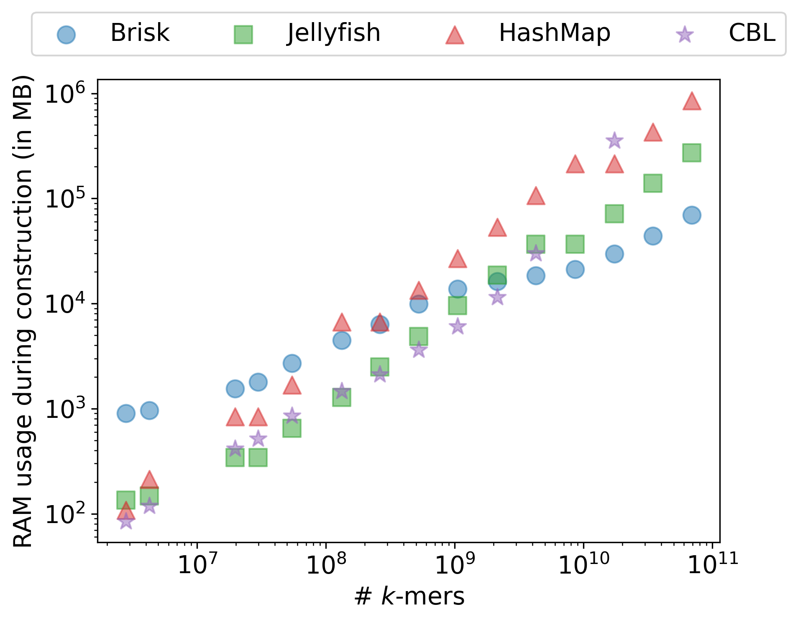
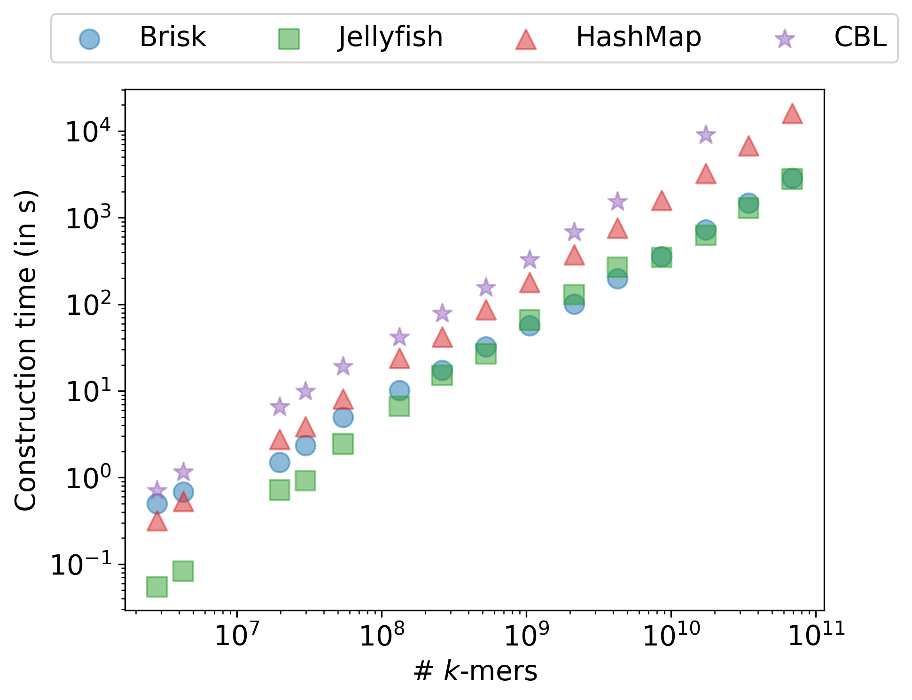

# Dynamic super‑*k*‑mer maps {#sec-skmer-maps}

:::{.callout-note}
This chapter is partially adapted from .
:::

- trim the article to focus on interleaved /skmer representation
- discuss load balancing strategies, when (not) to sort
- pros and cons compared to CBL (/kmer level vs /skmer level representation)
- the challenge of deduplicating /kmers with this representation (ongoing work)

---

@sec-skmers introduced super-/kmers as a natural byproduct of minimizer-based parsing: consecutive /kmers sharing a minimizer are grouped into a single string, reducing both the number of objects to index and the memory needed to represent each one.
This chapter asks whether /skmers can serve as the primary representation inside a *dynamic* /kmer dictionary, replacing individual /kmer entries altogether.

Using /skmers as a full dictionary representation, however, raises two new problems.
The first is lookup: given a /kmer, finding it efficiently inside a bucket of /skmers is not straightforward, because sorting /skmers lexicographically does not help locate a specific /kmer.
The second is representation: when a /kmer contains more than one occurrence of its minimizer, the choice of which occurrence to use must be made deterministically, or the same /kmer can end up encoded differently depending on the parsing context.
The main contributions of this chapter are a solution to both problems: a deterministic minimizer selection procedure that covers all edge cases, and a novel /skmer encoding called the *interleaved transform* that enables binary search within a bucket.
We also examine the load-balancing problem that arises from skewed bucket size distributions, and place the /skmer-level approach in relation to the /kmer-level approach of the previous chapter.

## Interleaved /skmers {#sec-interleaved-skmer-map}

### Lazy encoding of minimizers {#sec-encoding-skmer-map}

The dictionary is organized as a collection of buckets, one per minimizer: each /kmer is routed to the bucket of its minimizer and stored implicitly inside one of the /skmers held there.
Since all /skmers in a bucket share the same minimizer, we can avoid storing that minimizer in each /skmer.
In a maximal /skmer, the position of the minimizer within the sequence is determined by the /skmer's length, so the minimizer can be omitted from the encoding and reconstructed on demand.
This *lazy encoding* lowers the per-/kmer bit cost: a maximal /skmer of length $2k - m$ bases encodes on average $(w + 1)/2$ /kmers, giving a ratio of $\frac{8(k - m)}{w + 1} = 8 \left(1 - \frac{1}{w+1}\right)$ bits per /kmer, which for practical values of $k$ and $m$ is slightly below 8 bits.

To simplify memory management and allow constant-time access to any /skmer in a list, every /skmer is allocated at its maximum possible length of $2k - m$ bases, with padding where the sequence is shorter.
This wastes some space compared to variable-length encoding, but avoids the overhead of storing and decoding per-/skmer lengths and makes the list amenable to binary search.

### The bucket lookup problem

Looking up a /kmer in its bucket means checking whether it appears in any of the /skmers stored there.
A /kmer has at most one possible position within a given /skmer, determined by the relative positions of their minimizers, so each individual comparison is cheap.
The difficulty is that buckets can be very large, so a linear scan may end up being costly.

To use binary search, we need to sort the /skmers.
However, standard lexicographic order does not help here: it weights the outermost bases first, which are the least shared among the /kmers of a /skmer.
The leftmost base of a maximal /skmer belongs to only one of its /kmers, the next to two, and so on inward toward the minimizer.
Effective binary search needs the discriminating bases to come first, but lexicographic order puts them last.

### Interleaving

We propose a base reordering, the *interleaved transform*, that addresses this.
The interleaved form of a /skmer starts with the minimizer sequence, then alternates between the base immediately to its left and the base immediately to its right, expanding outward until all positions are exhausted.
Positions with no base (because the /skmer does not extend as far in one direction) are filled with the character N.
@fig-brisk-interleaved shows examples of this transform.

{#fig-brisk-interleaved}

The same transform applied to a /kmer (viewed as a /skmer of minimal length) yields a key structural property: a /kmer is contained in a /skmer if and only if its interleaved form is a prefix of the interleaved /skmer, where N matches any character.
This follows because the bases of a /kmer and of any longer /skmer that contains it agree on the /kmer's extent, and the interleaved order respects this nesting.

Given this property, /skmers can be sorted lexicographically in their interleaved form and queried by binary search.
Each non-N base in the query /kmer narrows the search space by a factor of up to four, so in most cases the bucket is searched in $\mathcal{O}(\log S)$ steps rather than $\mathcal{O}(S)$.

### Limitations

The N characters in the query play a special role: because N must match any character, a step involving an N does not reduce the search space, and all four sub-searches must be pursued in parallel from that point.
This is harmless when N characters appear only at the end of the query, after the search space has already been reduced to a small number of candidates.
It is costly when the minimizer sits at the very start or end of the /kmer, which places N characters at the beginning of the interleaved form and prevents any early reduction of the search space (@fig-brisk-supersort).
Such /kmers degrade to near-linear probing.
In practice, the minimizer occupies an interior position for the large majority of /kmers, so this worst case is rare, arising mainly at sequence boundaries or with very small window sizes.

{#fig-brisk-supersort width=70%}

## Load balancing and superbuckets {#sec-superbuckets-skmer-map}

### Skewed bucket sizes

The interleaved sort provides sublinear lookup within a bucket, but the benefit is diluted when bucket sizes are highly skewed.
As established in @sec-kmer-sets, minimizer partition sizes are highly non-uniform in practice: a small fraction of minimizers attract a disproportionately large number of /skmers, and these very large buckets can dominate overall query time even when the average size is moderate.

### Superbuckets via bijective hashing

Applying a hash function to minimizer values would spread them uniformly across buckets, but a surjective hash introduces collisions between distinct minimizers, which is unacceptable for an exact structure.
A bijective hash, a reversible permutation over minimizer values, achieves the same uniformity without any loss of information.

Building on this, we group the $4^m$ possible minimizer buckets into $4^b$ superbuckets by using the first $b$ bits of each hashed minimizer value as the superbucket index.
Because the permutation distributes minimizer values uniformly, each superbucket aggregates $4^{m-b}$ original buckets and superbucket sizes are far less skewed than individual bucket sizes.
@fig-brisk-superbucketsexamples shows the successive construction steps.

Within a superbucket, /skmers from different minimizer buckets remain distinguishable because the full interleaved form starts with the hashed minimizer, which is distinct across buckets.
Binary search therefore traverses the minimizer prefix at no extra cost before entering the bucket-specific portion of the sorted list.
The original minimizer can always be recovered from the hashed value because the permutation is invertible.

{#fig-brisk-superbucketsexamples}

### Sorting and buffering

Maintaining a strictly sorted list on every insertion would require an $\mathcal{O}(S)$ shift per operation, which is expensive as buckets grow.
A practical solution is to keep a small unsorted buffer alongside the sorted list: new /skmers enter the buffer and are scanned linearly until the buffer reaches its capacity, at which point the combined list is sorted and the buffer is cleared.
This amortizes sorting cost across many insertions without changing asymptotic lookup time.
A larger buffer improves insertion throughput at the cost of slower scans during the buffer-filling phase, making the buffer size a tunable time-memory tradeoff.

## Super-/kmer versus /kmer level representation {#sec-comparison-skmer-map}

The /kmer-level approach taken by CBL and the /skmer-level approach described here reflect a fundamental choice in how to organize a dynamic /kmer dictionary.

In a /kmer-level structure, each /kmer is an independent record.
Insertion, lookup, and deletion each act on exactly one entry.
CBL exploits the necklace equivalence and a prefix/suffix decomposition to approach the information-theoretic lower bound per distinct /kmer, while still supporting in-place set operations.
The operations are clean: because every /kmer maps to a unique canonical representative, deduplication is structural rather than a separate concern.

In a /skmer-level structure, /kmers are stored implicitly inside longer strings.
The benefit is that neighboring /kmers sharing a minimizer are encoded together, and the shared minimizer is not repeated.
This yields a lower bits-per-/kmer footprint, and insertion is streaming-friendly since a new /skmer is placed directly into the appropriate bucket without decomposing it into individual /kmers.

The main cost is that the same /kmer can in principle appear in multiple /skmers.
This happens when the same /kmer arises from overlapping reads or is inserted more than once via different /skmers.
In CBL, deduplication is inherent since each /kmer maps to a unique necklace and a unique bucket entry.
In a /skmer structure, deduplication requires either a membership test before every insertion (which partially erases the throughput advantage) or a post-processing step that is incompatible with streaming use.
This remains an open problem and the primary structural limitation of the /skmer-level approach.

A second consideration is the granularity of per-/kmer operations.
In a /kmer-level structure, the annotation or count associated with a single /kmer can be updated in isolation.
In a /skmer-level structure, accessing that annotation requires locating the /kmer within its containing /skmer, which is a lookup rather than a direct address.
For applications where every /kmer is visited at most once (graph traversal, read mapping), this difference is negligible.
For applications that revisit /kmers frequently or require deletion, the /kmer-level approach is more natural.

## Performance in practice {#sec-results-skmer-map}

The memory savings from lazy encoding and superbuckets translate into a substantially lower footprint than a plain hash table across dataset sizes, as shown in @fig-brisk-mainplot for $k = 31$.
The gap widens for larger $k$ since the minimizer then represents a smaller fraction of each /kmer, and the savings from omitting it are proportionally greater.
Construction throughput in the single-threaded setting is competitive with a standard hash map for $k = 31$ (@fig-brisk-mainplot), confirming that the binary search overhead is not a bottleneck in practice.

::::{#fig-brisk-mainplot layout-ncol=2}

{#fig-brisk-mainplot-ram-k31}

{#fig-brisk-mainplot-time-k31}

Memory usage and construction time for /kmer indexing with $k=31$, across increasing dataset sizes.
::::
