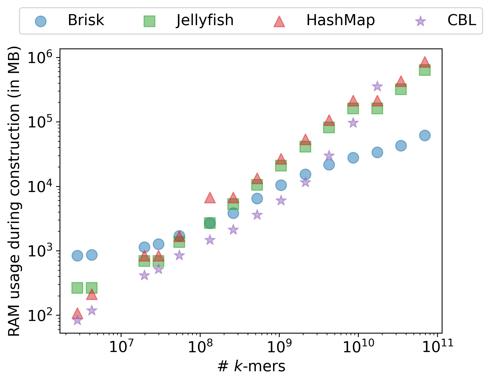
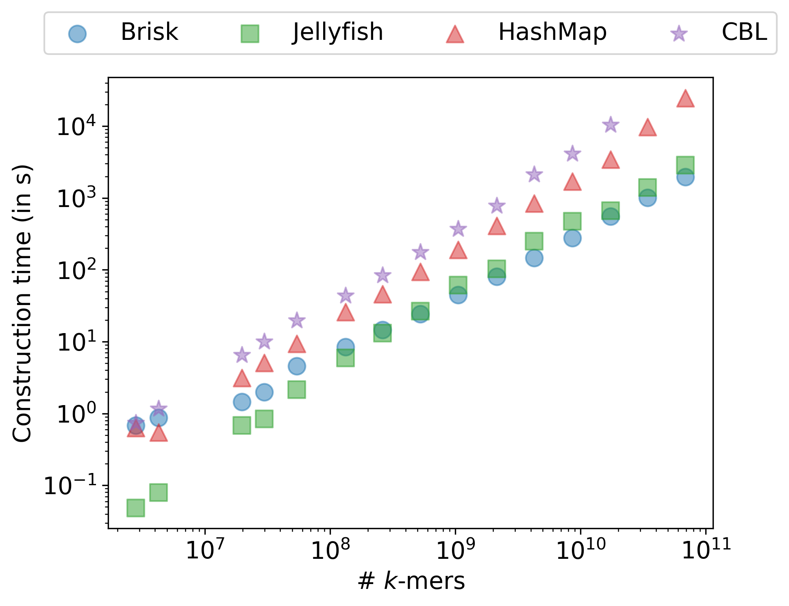
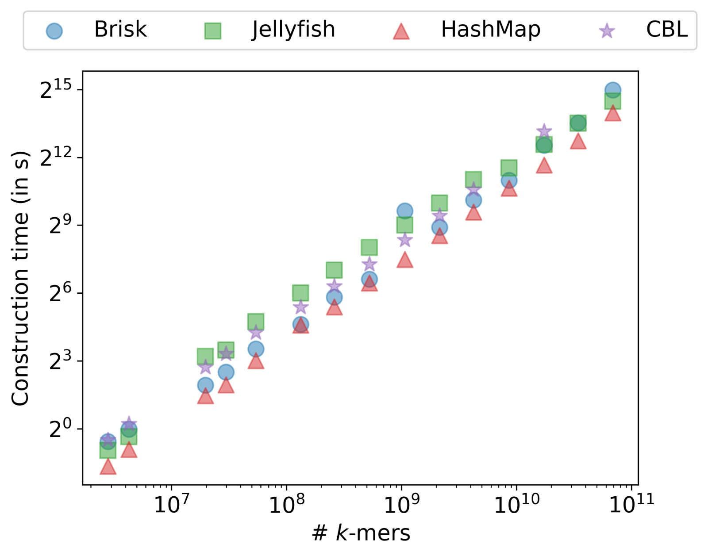
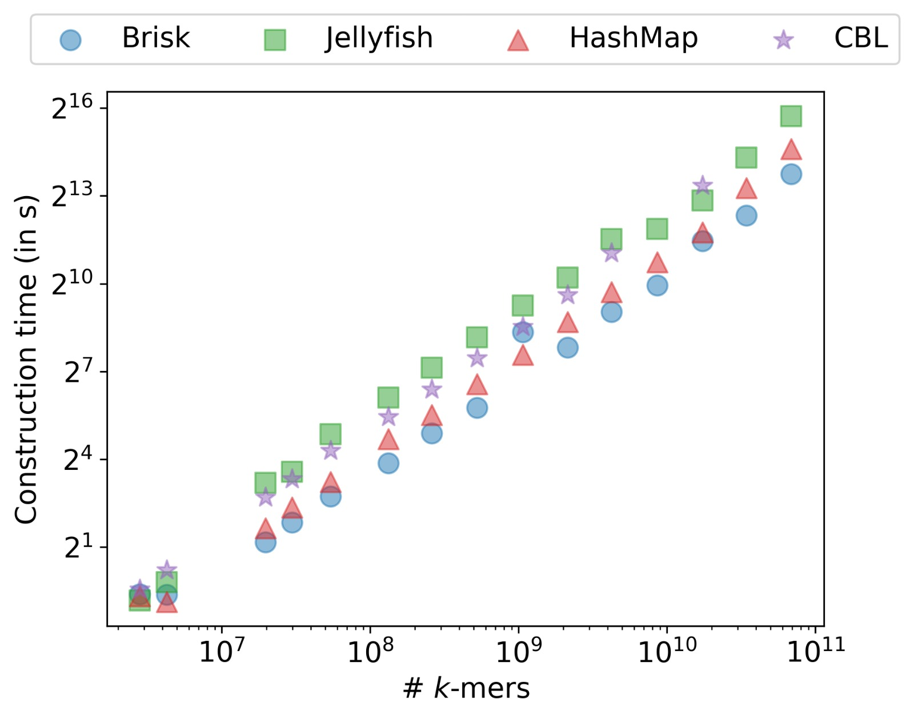

# Super‑k‑mer maps

:::{.callout-note}
This chapter is partially adapted from .
:::

## Introduction {#sec-intro-skmer-map}

Handling sequencing and genomic data is among the most memory-intensive tasks routinely performed in computational biology [@stephens2015big; @cremin2022big].
Superlatives abound in this field, with the mistletoe genome nearing 100 gigabases (`GCA_963277665.1`), recent sequencers capable of outputting 16 terabases per run, and future developments promising even more orders of magnitude improvement.
Additionally, genome databases like GenBank are rapidly expanding, now encompassing over 29 terabases of data.
Managing these massive datasets demands significant computational resources, driving the development of high-performance tools for commonly performed tasks such as alignment, assembly, and genotyping.

Since the advent of BLAST, a fundamental need has emerged to index /kmers and associate information with them [@jenike2024guide; @marchet2024advancementsc; @marchet2024advancements].
While /kmers offer several advantages, including efficient filtering, sensitivity/specificity trade-offs, and convenient representation as integers, they exacerbate memory usage challenges.
A text of $N$ bases generates $\mathcal{O}(N)$ /kmers (assuming no repeats), which represent $\mathcal{O}(N \cdot K)$ DNA bases.
With commonly used /kmer sizes ranging from 17 to 31, /kmers are often represented by 64-bit integers, leading to an 8-byte per /kmer footprint.
Consequently, handling gigabase-sized documents, which are already extremely memory-intensive, typically requires workstation-level resources.

Surprisingly, most tools still utilize generic dictionary/hashmap structures for /kmer indexing, despite their high memory costs, as the 8-byte per /kmer footprint is further multiplied due to the load factor [@moeckel2024survey; @breitwieser2018krakenuniq; @ren2017virfinder; @georgakopoulos2021leveraging; @mouratidis2025identification].
A viable solution to mitigate this memory usage is to avoid indexing all /kmers, instead using minimizers to ensure the scalability of tools [@minimap2; @benoit2024high; @fhs; @agret2021toward].
Recently, indexes capable of associating /kmers with additional information have been proposed.
These indexes generally fall into two categories: full-text indexes based on the Burrows-Wheeler Transform (BWT) (e.g., BOSS [@bowe2012succinct], Themisto [@alanko2023themisto]) or Minimal Perfect Hash Functions (MPHF) (e.g., BBHash [@limasset2017fast], PTHash [@pibiri2021pthash], Pufferfish [@almodaresi2018space], Blight [@blight], SShash [@sshash]).

While these structures can achieve very low memory footprints (below 8 bits per /kmer) and high throughput, they present two major caveats.
To reduce the memory footprint, these methods rely on assembling /kmers into sequences that can contain them in a memory-efficient manner.
Therefore, they depend on such spectrum-preserving string sets (SPSS) [@rahman2021representation] structures to construct their index, meaning that /kmers must be "assembled" before the indexing step.
Despite significant progress in this area, this remains a resource-intensive process (e.g. Bcalm2 [@bcalm2], Cuttlefish [@cuttlefish2], GGCAT [@ggcat]).

In a subsequent step, the index structures, either MPHF or BWT-based, must be built.
Consequently, while these indexes are resource-efficient, they are intrinsically static and require substantial resources to construct.
These efficient yet costly-to-construct indexes are particularly valuable in scenarios where the index is reused multiple times for a large number of queries.
However, in most applications, the number of queries is relatively low, and the construction cost is not justified.
For graph exploration tasks such as genotyping or assembly, most /kmers are just queried once during the whole procedure.
As a result, the construction of such indexes is often avoided, as it would be the time bottleneck of the application.

Another significant issue with static indexes is the need for complete rebuilding when incorporating new datasets.
If updates are frequent, the building costs become overwhelming.
Some semi-dynamic approaches have been proposed, using temporary buffers and partitions to delay reconstruction as much as possible [@alanko2021buffering; @almodaresi2022incrementally].
However, these approaches introduce latency, as some insertions trigger costly rebuilding operations, leading to periods when the index is unavailable.
Moreover, these methods are typically unsuitable for streaming applications, as they require multiple passes over the dataset.

Static approaches also assume that the set of /kmers to be indexed is known in advance.
In such cases, decisions about whether to index a /kmer can not be made based on the current state of the index.
For example, in an assembly or genotyping context, complex patterns involving highly repeated /kmers form densely interconnected clusters that become impractical to use. Once such a pattern is detected, any /kmer connected to it is also rendered unusable and therefore unnecessary. A dynamic approach could simply skip these /kmers. Similarly, undesired simple patterns, such as single-nucleotide bubbles, could also be omitted.
Finally and more critically, the indexing phase cannot be leveraged to associate data with the /kmer as it is inserted, unlike a dictionary, which can associate data with the /kmer immediately upon insertion.

Consequently, most applications require an index that can be quickly constructed in streaming with /kmer-level dynamism.

Such indexes are quite rare. Jellyfish [@jellyfish], which is very close to a classical hashtable, provides good performance by being lock-free.
CBL [@cbl] improves on this scheme by exploiting the locality of successive /kmers.
Both of these structures achieve very fast insertion and query times; however, since they do not rely on SPSS and use plain /kmer representation, they exhibit memory usage in $\mathcal{O}(N \cdot K)$.
Bifrost [@bifrost] is the only dynamic tool that actually relies on SPSS (unitigs in this case) to reduce memory usage, but it is almost an order of magnitude slower than a hashtable.

In this work, we aim to propose a drop-in replacement for /kmer dictionaries for many use cases, offering fast query/insertions while being orders of magnitude more memory-efficient than other dynamic methods, and providing /kmer-level dynamism.

## Methods {#sec-methods-skmer-map}

### Outline

In order to minimize the memory footprint of our dictionary, we aim to represent /kmers as SPSS.
However, most SPSS representations such as simplitigs [@rahman2021representation; @bvrinda2021simplitigs], matchtigs [@matchtigs], eulertigs [@eulertigs], and masked superstrings [@sladky2023masked] are defined globally from a complete /kmer set.
Updating such SPSS structures remains an open problem, making their use in dynamic structures even more challenging [@hannoush2024cdbgtricks].
Interestingly, one of the first SPSS used was /skmers, which are successive /kmers sharing a minimizer [@kmc2].
While this structure is more memory-intensive than other SPSS types, it remains lighter than plain /kmer representation by several folds.

The main advantage of /skmers is their locality; they can be built in streaming while parsing a sequence with minimal overhead, making them well-suited for dynamic usage.
Another significant advantage of /skmers over more space-efficient SPSS structures is that we can determine, without any additional context, to which minimizer a /kmer is associated, allowing us to use this minimizer for clustering /kmers [@reindeer; @marchet2023scalable].

By grouping all /skmers associated with the same minimizer, we can efficiently determine in which bucket a /kmer belongs, enabling searches within a smaller substructure.
Furthermore, since all /skmers in a bucket contain the same minimizer, we can skip the encoding of the minimizer in the /skmers, only encoding the prefixes and suffixes before and after the minimizer [@fhs].

However, within a set of $S$ /skmers sharing a minimizer (often referred to as a bucket), checking the presence of a given /kmer requires $\mathcal{O}(S)$ comparisons, which can be costly.
To complicate matters, buckets are known to have skewed size distributions, as lower minimizers tend to gather more /kmers than others leading to expensive search for a large number of /kmers [@chikhi2014representation; @kmc2; @marchet2023scalable].
Another challenge is that a /kmer may have multiple occurrences of its minimizers, potentially causing issues if a /kmer//skmer encoding depends on which minimizer is selected during parsing.
Therefore, we need a deterministic method to select a "canonical" minimizer when multiple occurrences arise.

Our practical dictionary implementation addresses these issues based on four key contributions, each discussed in the following sections:

- Indexing a low amount of memory-efficient /skmers using state of the art minimizer scheme.
- Leveraging large minimizers through lazy encoding, enabled by careful handling of duplicated minimizers.
- Sorting /skmers to accelerate fast probing.
- Using superbuckets to achieve uniform bucket distribution.

From a high-level perspective, the /kmers to be inserted are assigned to their respective (super)buckets based on their minimizers through an efficient partitioning scheme. Within each bucket, /kmers are compactly represented as /skmers, omitting the minimizer itself to achieve space efficiency. To expedite the lookup process for a specific /kmer among multiple /skmers, we introduce a novel representation that facilitates binary searches, significantly accelerating the majority of queries. The resulting index is fully dynamic, associating each /kmer with a unique pointer to user-defined data. Queries follow the same procedure as insertions; however, instead of inserting the /kmer, the method returns the associated pointer if the /kmer exists in the index or a NULL pointer otherwise.

### Indexing /Skmers

Since their introduction, minimizers have been widely used across a broad range of applications [@kmc2; @minimap2; @reindeer; @mapquik; @lphash; @marchet2023scalable].
A very powerful property of minimizers is that while every /kmer has a minimizer of size $m$, a trivial lower bound for the fraction of $m$-mers being minimizers, known as density, is $\frac{1}{k-m+1}$.
A simple scheme based on hashed $m$-mers achieves a near-optimal density of $\frac{2}{k-m+1}$ [@mod-mini].
In practice, this means that one can select a set of minimizers that is an order of magnitude smaller than the /kmer set.
As a result, the corresponding /skmers can group numerous /kmers together.
For random minimizer density, we can theoretically expect $(k-m+1)/2$ /kmers per /skmer, assuming they are extracted from a long sequence with appropriate parameters.
In @fig-brisk-superkmerstats, we show the mean /skmer size that can be obtained for standard values of $k$ and $m$, and observe that practical results closely match this approximation.
This leads to a memory footprint lower bounded by $\frac{2(3k-m-1)}{k-m+1}$ bits per /kmer.
In practice, since /skmers have distinct sizes, an additional cost of $\log(k-m+1)$ bits must be added to encode the /skmer size.
A simpler practical alternative is to allocate the maximum size for every /skmer.
If we neglect /kmers with duplicated minimizer, the maximal size of a /skmer corresponds to the case where the first /kmer has its minimizer at the rightmost position and the last /kmer has its minimizer at the leftmost position.
These represent $2k-m$ bases encoding $\frac{k-m+1}{2}$ /kmers and provide a bits-per-/kmer ratio of $\frac{4(2k-m)}{k-m+1}$.
While this representation is more costly, it offers very convenient properties such as constant access to elements in the list and efficient preallocation, enabling sublinear search within the list, which we aim to implement in this work.

This memory cost assumes the use of hashed minimizers that provide a density of $\frac{2}{k-m+1}$.
Being able to select fewer minimizers would result in fewer, larger /skmers and a reduced memory cost.
Several works have aimed to further improve minimizer density, such as miniception [@miniception], decycling sets [@pellow2023efficient], and mod-minimizers [@mod-mini].
In this work, we pragmatically chose to use the decycling set scheme [@pellow2023efficient] as an improved minimizer scheme for its computational efficiency and practical improvement in /skmer length on our parameter range.
In @fig-brisk-DDbonus, we display the improvement in mean /skmer length using the double decycling set compared to the random minimizer scheme.
Since these minimizers can be selected in streaming with minimal computational overhead, we use them to benefit from a reduced number of minimizers to index, resulting in larger /skmers and an improved bits-per-/kmer ratio.

:::: {#fig-brisk-combined-superkmer layout-ncol=2}

{#fig-brisk-superkmerstats}

{#fig-brisk-DDbonus}

Analysis of /Skmer Statistics and Strategy Differences on *E. coli* reference genome. (a) Shows the mean number of /kmers per /skmer based on varying /kmer and minimizer sizes. (b) Illustrates the mean difference in /kmers per /skmer between double decycling and hashed minimizer strategies.
::::

### Lazy Encoding and Multiple Minimizers

When encoding all /skmers associated with a given minimizer, we can exploit the fact that the minimizer sequence is present in each /skmer.
Moreover, in a maximal /skmer, the position of the minimizer is known, so it can be skipped entirely.
This results in a bits-per-/kmer ratio of $\frac{8(k-m)}{k-m+1}$ per /skmer if we neglect the cost of storing the minimizer, as it is encoded once per bucket.
For practical values of $k$ and $m$, $\frac{8(k-m)}{k-m+1} \approx 8$, which is roughly one byte per /kmer.

Although this lazy encoding strategy reduces memory usage, it requires each /kmer's minimizer position and strand within its sequence to be determined consistently.
While this is not an issue in most cases where the minimal $m$-mer sequence occurs only once within its /kmer, situations with multiple occurrences are often overlooked and labeled as edge cases.
Additionally, some studies disregard the reverse complement aspect of DNA sequences, which can have a significant impact in practice [@marcais2024k].

Selecting a minimizer position also implies choosing the strand of the /kmer, as a /kmer and its reverse complement can have the same, canonical, minimizer at different positions, leading to ambiguity in how the /kmer is stored.
In the following, we define a complete and deterministic method to select a given occurrence of the minimal $m$-mer across a /kmer sequence or its reverse complement.

To determine the minimizer position and strand in these cases, we check both the /kmer sequence and its reverse complement and apply three selection rules to ensure consistency:

1. Canonical minimizer
2. Leftmost canonical minimizer
3. Leftmost canonical minimizer from canonical /kmer

In most cases, as shown in @fig-brisk-canon (A), the minimizer appears once in the /kmer but also appears in its reverse complement.
The first rule is to consider only canonical $m$-mers ($m$-mers smaller than their reverse complements) as potential minimizers.
This fixes the /kmer strand as only one strand contains the canonical minimizer (@fig-brisk-canon A).

However, in a minority of cases, the canonical minimizer occurs more than once within a /kmer.
This duplication can occur either on the same strand (@fig-brisk-canon B) or across both the canonical and complementary /kmer (@fig-brisk-canon C).
To handle this, we apply the second rule: always select the leftmost occurrence of the canonical minimizer among the /kmer and its reverse complement.
In @fig-brisk-canon (B), where both occurrences are on the same strand, the leftmost minimizer on this strand is chosen.
In @fig-brisk-canon (C), the minimizer in the reverse complement /kmer is selected because its position is lower than the corresponding occurrence in the canonical strand.

A rare edge case arises when two leftmost canonical minimizers exist simultaneously: one in the canonical /kmer and one in its reverse complement.
These "mirror" cases are resolved by selecting the minimizer in the canonical /kmer as depicted in @fig-brisk-canon (D).
Note that the parity of $k$ does not complicate this process. If $k$ is odd, palindromic /kmers are impossible, so one strand is inherently superior. For even $k$, palindromic /kmers are possible, but both strands are equally canonical, ensuring no ambiguity.

By following these rules, every /kmer is deterministically associated with a strand and a minimizer position.

![Four cases of canonical minimizer selection within a /kmer. The blue bars represent the canonical /kmers, while the gray bars represent the complementary /kmers. The occurrences of a /kmer minimizer are represented by arrows: white arrows for minimizers whose $m$-mer is canonical and black arrows for non-canonical ones. The minimizer occurrence highlighted in green is the one selected, while the red ones are not selected. Case A presents the most common scenario, where there is no duplicated minimizer; the one with the canonical sequence is selected following rule 1. Case B presents a duplicated minimizer where both occurrences appear canonical on the same strand, while Case C presents canonical occurrences on both strands. In either case, following rule 2, the canonical occurrence at the leftmost position within its own strand is selected. Case D is the rare case where the leftmost canonical occurrences of each strand are at the same position. In such cases, following rule 3, we favor the one in the canonical /kmer.](../fig/brisk/CANON){#fig-brisk-canon}

### /Skmer Probing

/Skmers are widely used as memory-efficient /kmer representation.
A reason for this, beside the ones previously mentioned, is that a given /kmer has at most one possible potential position in a given /skmer (zero if they have different minimizer) obtained from their relative minimizer position.
However, given a /kmer, its corresponding bucket—containing all /kmers sharing its minimizer—can be extremely large, making comparisons computationally expensive. The objective is therefore to accelerate this search.
A set of /kmers can be placed in a hashmap-like data structure to get practical constant query time but hashing /skmers would not allow to perform included /kmer queries.
Similarly, probing a /kmer in a sorted /kmer list can be performed efficiently in sublinear time using binary search, but sublinear probing in a /skmer list is not trivial, as sorted /skmers are irrelevant to the /kmer's location in the list.

To improve from naive linear probing we introduce a novel /skmer representation that we call interleaved /skmers and show that searching in a sorted list of interleaved /skmers can lead to sublinear probing.

Intuitively sorting /skmers as is is not a good idea because it gives most importance to the first bases.
This seems irrelevant for at least two reasons.
First the left bases have crucial impact while right are mostly irrelevant despite having symmetrical properties.
Secondly, the leftmost (resp. rightmost) bases are the less important in the sense that they are shared by fewer /kmers than "central" bases that surround the minimizer.
If the minimizer is shared by all /kmers, the leftmost (resp. rightmost) base is exclusive to a given /kmer, the next base is shared by two /kmers and so on.
Inversely the base next to the minimizer is shared by every /kmer but one, the next by every /kmer but two and so on.
Based on this observation we propose a base reordering that prioritizes the most shared bases.
The interleave transformation of a /skmer starts by its minimizer sequence and is followed by the next base at its left then the base at its right and repeating this process iteratively alternating left and right bases.
When no bases are available, a N character is used to encode this absence.
Some examples of this transformation are shown in @fig-brisk-interleaved.
As premised the bases are ordered according to how likely they are to be shared by numerous /kmers.
Such transformation can also be applied on a /kmer as it is a /skmer itself.
An interesting property of this transformation is that a /kmer is included in a /skmer if and only if its interleaved form is a prefix of the interleaved /skmer, assuming that the character 'N' matches any other character.
Note that this property works for any /skmer and not exclusively for the /kmer case.
We also highlight that this property would hold for any deterministic order over the bases of a /skmer but we chose the bases that are the least likely to be a N.
While this property does not grant anything in itself as it does not simplify the /kmer presence test, it allows the interleaved /skmer to be sorted and to perform a binary search.
Several examples of binary search are displayed in @fig-brisk-supersort; we observe that very few steps are necessary to find a given location as every base divides the search space by four.
However when there is a N in the /kmer it could be present within a /skmer with any nucleotide at this position so the search space is not reduced and the four possibilities have to be checked with the following bases.
This means that from the first N appearance the probing will alternate between a useful base that divides the search space and an exhaustive search impeding the search.
If this happens at the end of the probing when the search space is small this hardly impacts search time.
However if this happens in the first bases when the search space is very large the actual probing becomes closer to a linear probing.
The specific worst case for our representation is when /kmers start or end with their minimizer as it generates N characters from the beginning of the interleaved /skmer.
Such /kmers are the most difficult to probe as displayed in @fig-brisk-supersort.
However all other cases benefit from exponential reduction of the search space from first bases.

{#fig-brisk-interleaved}

![Examples of /kmer search in a bucket of 32 /skmers. M denotes the bucket minimizer. The colored bars indicate the successive possible search spaces after each step. /Kmer 1 search represented by blue bars starts with A, then C that reduces the search space and G that limits the search to one /kmer and ends it. /Kmer 2 search represented by green bars starts with T but the next char is a N so it is not useful and the search space is unchanged, the next character is a G that provides several smaller search spaces, once again a N char that cannot be used and finally the C limits the search to one /kmer and ends it. /Kmer 3 search represented by red bars starts with a N so every position is a possible match, the second character T provides four distinct search spaces, the next char N does not help, the next char G limits the search to one position and ends it.](../fig/brisk/SortedSuperkmers){#fig-brisk-supersort}

### Superbuckets

Since our approach indexes /skmer lists associated with a minimizer, which we call a bucket, the size of the chosen minimizer, $m$, is crucial.
For a given $k$, a smaller minimizer can generate fewer but larger /skmers.
However, since there are $\mathcal{O}(4^m)$ possible minimizers, a larger minimizer results in more, smaller buckets that are faster to probe.
Therefore, the minimizer size acts as a time-memory trade-off.
Although increasing $m$ by two (to keep it odd) can slightly improve the mean number of /kmers per /skmer (see @fig-brisk-superkmerstats), it also multiplies the number of potential buckets by 16, highly impacting the mean bucket size. Thus, the advantages of larger minimizers tend to outweigh those of smaller ones.

However, due to various factors—both biological (such as repeats or distribution biases) and computational (such as reverse complement considerations and the fact that minimizers are minimal over $k-m+1$ other values)—minimizers are often poorly distributed, leading to two distinct problems: a large number of empty buckets and some very large buckets [@sshash].
To illustrate this phenomenon, we plot the bucket size distribution for the *C. elegans* reference genome compared to a random sequence of the same size in @fig-brisk-distribsuperbucket.
We observe that no bucket from the random sequence contains $2^7$ or more elements, while several buckets from *C. elegans* contain more than $2^{10}$ elements.
We also see that *C. elegans* generates more very small buckets than the random sequence.
These observations highlight the skewed nature of genomic data that negatively impacts our scheme.

To address this issue, we introduce the concept of superbuckets, which merge multiple buckets into one in a uniform manner.
Since the problem lies in the non-uniform distribution of minimizers, a simple solution is to use a hash function to achieve a uniform distribution.
However, using a surjective function would lose information and allow hash collisions for different minimizers, leading to false-positive matches.
To prevent this, we use a bijective/invertible function that guarantees the original minimizer can be retrieved from its hashed value.
We then use the hashed minimizer prefix to group multiple buckets together.
As bijective hashing changes the order without changing the distribution, buckets are uniformly grouped together, smoothing the difference in number of /kmers inside the super-buckets.

In practice, only $4^b$ ($b < m$) superbuckets are used, based on the first $b$ nucleotides of the interleaved /skmers with hashed minimizers.
Since the hashed minimizer bits are uniformly distributed, the number of buckets per superbucket is also uniform.
Although the bucket sizes are not uniform, superbucket sizes are less skewed.
@fig-brisk-distribsuperbucket shows the size distribution of regular buckets versus superbuckets with different $b$ parameters: $m=b+2$ results in an average of 16 buckets per superbucket, $m=b+4$ results in 256 buckets per superbucket, and $m=b+6$ results in 4096 buckets per superbucket.
We observe that smaller $b$, relative to $m$, leads to fewer large buckets and more small ones, improving overall bucket size and consequently reducing probing time.

This optimization has minimal drawbacks, as minimizers (and therefore /kmers) can be reconstructed since an invertible hash is used, as the hashed minimizer value can be reconstructed from its superbucket information.
One might argue that merging small buckets into larger superbuckets could hinder searching.
However, because these superbuckets are sorted, the distinct buckets within them are not mixed.
@fig-brisk-superbucketsexamples illustrates the construction steps of a (sorted) superbucket, showing that /skmers sharing a common minimizer are grouped inside the superbucket.
Therefore, a probed /kmer is guaranteed to quickly find its bucket, as there is no N character within its (hashed) minimizer.
The worst-case scenario, where the first /kmer nucleotide is an N, still occurs but within much smaller buckets.

{#fig-brisk-distribsuperbucket}

![Example showing the successive representation of /skmers. Minimizers are highlighted in yellow. /Skmers are the usual plain text representation of successive /kmers sharing a minimizer (1). Interleaved /kmers, our introduced transformation, start with the minimizer, with nucleotides closer to the minimizer appearing before those further away (2). Minimizers are then hashed using a reversible hash function to obtain a uniform distribution (3). A superbucket AA is constructed from the first two nucleotides, which are implicit since they all belong to superbucket AA (4). The /skmers in the superbucket are then sorted to enable fast probing (5).](../fig/brisk/superbuckets){#fig-brisk-superbucketsexamples}

### Implementation Details

Our goal is to develop a generic dictionary structure utilizing C++ templates, where each /kmer is associated with a user-defined data type, such as a 32-bit integer or a 64-bit pointer.
In practice, these data are stored in an array alongside the /skmer list.
Specifically, the $i$-th element of the data array corresponds to the $i$-th /kmer in the /skmer list. During sorting operations, the data values are swapped in tandem with their corresponding /kmers to maintain the correct associations.
To enhance efficiency and avoid the overhead of sorting a large /skmer list with every insertion, we implement a buffering strategy.
A small buffer stores unsorted /skmers, which are scanned linearly.
Once the buffer reaches its capacity, the entire /skmer list is sorted, and the buffer is subsequently cleared. This approach minimizes the frequency of sorting operations, thereby improving overall performance.
The effects of this buffering strategy on performance are further analyzed and discussed in the Results section.

## Results {#sec-results-skmer-map}

We implemented the aforementioned strategies in a C++ open-source software named **Brisk** (Brisk Reduced Index for Sequence of /Kmers), available at <https://github.com/Malfoy/Brisk>. Brisk is designed as a C++ library to serve as a dictionary for /kmer sequences. Its interface is straightforward and includes the following functionalities:

- **Query Function**: Queries /kmers from a sequence and returns a pointer to the associated value of each present /kmer.
- **Insert Function**: Inserts /kmers from a sequence and returns the associated pointers.
- **Iterator**: Iterates over the indexed /kmers and their corresponding values.
- **Serialization Function**: Serializes the data using the KFF format [@kff].

As discussed in the introduction, the applications of a /kmer dictionary are extensive due to its versatility. To evaluate the performance of Brisk, we focused on one of the simplest and most common uses of such a structure: /kmer counting. We compared Brisk against the standard Rust `HashMap`, Jellyfish [@jellyfish], a popular /kmer counter based on an efficient hash table, and CBL [@cbl], a /kmer set data structure capable of associating a unique identifier to each /kmer.

All experiments were conducted on a single cluster node equipped with an Intel(R) Xeon(R) Gold 6130 CPU @ 2.10GHz, 128GB of RAM, running Ubuntu 22.04.
To minimize the impact of I/O and parsing operations—which are outside the scope of this work—we aimed to reduce redundancy in the processed documents and optimize the number of distinct /kmers. While using random DNA sequences would have been ideal with no large repeated sequences, we opted to evaluate our methods on real-world sequences.
Specifically, following the interest of indexing large bacterial databases [@bradley2019ultrafast] for genomic epidemiology and surveillance, we focused on bacterial genomes due to their high diversity, which aligns well with our testing requirements. For benchmarking, we downloaded 308,568 bacterial genomes from the NCBI FTP website and randomly selected large subsets of increasing sizes from this collection.
The accession list of the bacterial genomes used is available in the Brisk Git repository, and the performed benchmark, including command lines, can be found at <https://github.com/imartayan/BRISK_experiments>.

### Influence of Parameters

In our first experiment, we benchmarked various bucket sizes to explore the available time-memory trade-off. @fig-brisk-diff-b illustrates the indexing of collections of increasing size using different values of the parameter $b$, which allocates $4^b$ distinct buckets. The tested values range from $4^9$ (262k buckets) to $4^{17}$ (17 billion buckets). For readability, only odd values of $b$ are plotted.

As expected, the memory overhead of Brisk increases exponentially with increasing values of $b$ when dealing with small collections. However, in larger collections, memory usage becomes dominated primarily by the /skmers filling the buckets, making it less sensitive to variations in $b$. Consequently, larger $b$ values become advantageous for extensive datasets.

Furthermore, choosing a very small $b$ can negatively impact performance on large datasets due to the complexity involved in handling excessively large buckets. On the other hand, unnecessarily large $b$ values for smaller datasets introduce avoidable overheads in both computation time and memory usage.

Our experimental results suggest that a value of $b$ around 12 provides an optimal trade-off between performance and memory consumption across a variety of dataset sizes. This makes it an effective default parameter that does not require specialized user knowledge for tuning.

This observed behavior remains consistent regardless of the specific value chosen for the /kmer length. Regarding the minimizer size $m$, performance is only minimally impacted, provided that $m > b + 1$. It is important to note, however, that larger values of $m$ reduce the /skmer lengths, thus diminishing their overall utility.

:::: {#fig-brisk-diff-b layout-ncol=2}

{#fig-brisk-diff-b-ram}

{#fig-brisk-diff-b-time}

Memory usage (left) and construction time (right) of Brisk with varying values of $b$ and $k=31$. Higher values of $b$ result in increased memory usage but lead to faster construction times.
::::

### Multicore Utilization

Brisk's architecture distributes the dictionary across thousands of substructures, facilitating coarse-grained parallelism. Concurrent access to a given bucket is managed using mutexes to ensure thread safety. In our second experiment, presented in @fig-brisk-cores, we show the wall-clock time measured for Brisk construction using different numbers of CPU cores, compared against the theoretical best speedup predicted by Amdahl's law.

The results demonstrate that Brisk scales efficiently with the number of cores up to eight cores, closely approaching the optimal runtime given the fact that some operations like IO can't be accelerated.
Beyond eight CPU cores, the performance gains diminish, likely due to increased contention and management overhead from managing multiple threads.

### Sorting Efficiency and Unsorted Buffer Size

In the third experiment, illustrated in @fig-brisk-bufferbench, we evaluated Brisk's performance using different sizes of the unsorted buffer, including a configuration without sorting ($no\_sort$). Our findings indicate that the novel sorting method employed by Brisk substantially enhances performance. Without sorting, linear probing becomes prohibitively expensive as bucket sizes increase. Conversely, sorted buckets enable more efficient sublinear probing.

Moreover, implementing a buffer to temporarily store unsorted /skmers reduces the frequency of sorting operations, thereby improving overall performance in practical scenarios.

:::: {#fig-brisk-combined layout-ncol=2}

{#fig-brisk-cores}

{#fig-brisk-bufferbench}

Performance analysis of Brisk construction under varying buffer sizes and multithreading configurations.
::::

### Comparison with Standard Hashing Methods

We conducted a comprehensive comparison of Brisk, Jellyfish, CBL, and a standard Rust `HashMap` across growing collections of bacterial genomes, ranging from $2^0$ to $2^{14}$ bacteria. For each dataset, we recorded both the wall-clock time and memory usage. Two /kmer sizes were evaluated: $k=31$, a commonly used value that fits within a 64-bit integer, and $k=59$, the maximum size supported by CBL.

@fig-brisk-mainplot presents the results for $k=31$ and $k=59$. For $k=31$, Brisk demonstrates dramatically lower memory usage compared to the state-of-the-art methods, while matching Jellyfish's speed.
Notably, for $k=59$, as shown in @fig-brisk-mainplot-ram-k59, the memory consumption advantage of Brisk becomes even more pronounced, and Brisk emerges as the fastest indexing structure.

However, it is important to note that the wall-clock time comparisons may not be entirely fair, as CBL and the Rust `HashMap` were not parallelized. To address this, we also performed the same benchmark using a single core, with results displayed in @fig-brisk-monothread. In the single-threaded scenario, Brisk remains comparable to the fast Rust `HashMap` for $k=31$, albeit slightly slower, and retains its position as the fastest index for $k=59$.

:::: {#fig-brisk-mainplot layout="[[1,1],[1,1]]"}

{#fig-brisk-mainplot-ram-k31}

{#fig-brisk-mainplot-time-k31}

{#fig-brisk-mainplot-ram-k59}

{#fig-brisk-mainplot-time-k59}

Performance comparison of Brisk, Jellyfish, CBL, and Rust `HashMap` across increasing numbers of /kmers. (a) and (c) depict memory usage, while (b) and (d) show construction times for $k=31$ and $k=59$ respectively. Brisk exhibits superior memory efficiency and competitive construction times.
::::

:::: {#fig-brisk-monothread layout-ncol=2}

{#fig-brisk-monothread-k31}

{#fig-brisk-monothread-k59}

Single-threaded performance of Brisk, Jellyfish, CBL, and Rust `HashMap` across increasing numbers of /kmers. (a) corresponds to $k=31$, and (b) corresponds to $k=59$. Brisk maintains competitive performance, especially at larger /kmer sizes.
::::

### Query Times

In @fig-brisk-query, we compare the performance of Brisk in terms of query times for insertions, positive queries (queries for /kmers present in the index), and negative queries (queries for /kmers absent from the index) as the number of /kmers increases.
To measure insertion time, an increasing number of bacterial genomes are added to the index. The same dataset is then used to evaluate positive query times.
Finally, a FASTA file consisting of random sequences with an equivalent number of /kmers is used to assess negative query times.
The results show that the throughput of Brisk remains nearly constant as the size of the index grows. Positive queries are several times faster than insertions, while negative queries are even faster, demonstrating an order-of-magnitude improvement over insertion times.
A comprehensive benchmark comparing the performance of building, positive, and negative queries between CBL and the Hashmap is presented in @tbl-brisk-queries for completeness, using 200 bacterial genomes from RefSeq. Since Jellyfish is a /kmer counter, we could not find an easy way to benchmark its query time, and it is therefore not included in this evaluation.

:::: {#fig-brisk-query layout-ncol=2}

{#fig-brisk-query-k31}

{#fig-brisk-query-k59}

Comparison of positive and negative query performances relative to insertion operations across increasing numbers of /kmers. Sub-figure (a) illustrates results for $k=31$, while sub-figure (b) shows results for $k=59$.
::::

| Tool | Task | Time (s) | Throughput (million k-mers/s) | RAM (GB) | Bits per **distinct** k-mer |
|------|------|----------|-------------------------------|----------|-----------------------------|
| CBL | Build | 135.0 | 6.2 | 13.3 | 230.7 |
| Hashmap | Build | **94.4** | **8.8** | 26.7 | 463.2 |
| Brisk | Build | 99.1 | 8.4 | **5.2** | **90.2** |
| CBL | Positives queries | 138.9 | 6.0 | 10.2 | 176.9 |
| Hashmap | Positives queries | 176.8 | 4.7 | 26.7 | 463.2 |
| Brisk | Positives queries | **77.0** | **10.8** | **5.2** | **90.2** |
| CBL | Negatives queries | 140.9 | 5.9 | 10.2 | 134.0 |
| Hashmap | Negatives queries | 111.3 | 7.5 | 26.7 | 350.7 |
| Brisk | Negatives queries | **68.5** | **12.2** | **5.2** | **90.2** |

: Queries performances benchmark on 200 bacterial genomes from Refseq with k=59. {#tbl-brisk-queries}

## Conclusion and Future Work {#sec-conclusion-skmer-map}

In this study, we introduced a proof of concept for adapting a classical dictionary scheme by efficiently indexing /skmers using a novel interleaved transform. This transform induces a partial ordering, enabling binary search in most cases. Our implementation, Brisk, achieves state-of-the-art throughput while dramatically reducing RAM usage. Additionally, Brisk maintains exactness and offers versatility by handling various types of data through templating.

We anticipate that Brisk can serve as a drop-in replacement for traditional /kmer dictionaries, thereby enhancing the scalability of numerous tools and workflows. However, there are several features that could be added to further advance this work.
For example, extending support to different alphabets, such as proteic or three-dimensional ones, is necessary. Currently, the integer representation of /kmers limits the maximum /kmer size to 63, as it must fit within 128-bit integers.

Beyond these implementation-level considerations, the current state of Brisk raises important theoretical questions. Presently, /skmers are inserted into the index as they are read from the input, meaning that once a /skmer is inserted, it remains unchanged and any empty positions within it are never filled. An improvement would involve allowing new /kmers to be inserted into existing /skmers, thereby optimizing memory usage.
Efficiently performing such operations poses practical challenges, and theoretically, it remains uncertain whether this greedy strategy is optimal.
This issue is related to the Spectrum Preserving String Set problem but applied to a collection of /kmers sharing a minimizer. Another theoretical question, not specific to Brisk, involves finding an improved balance or density in the index and developing more efficient methods for indexing seeds.

Addressing these challenges will not only enhance Brisk's functionality but also contribute to the broader understanding of /kmer indexing strategies.
